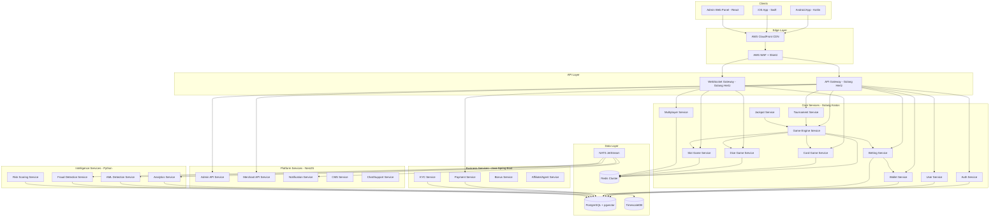
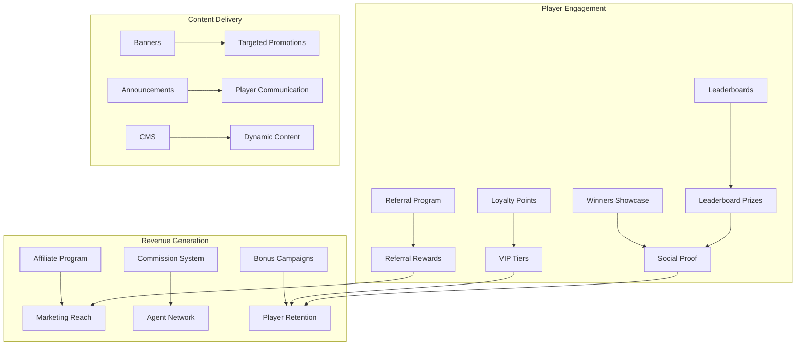
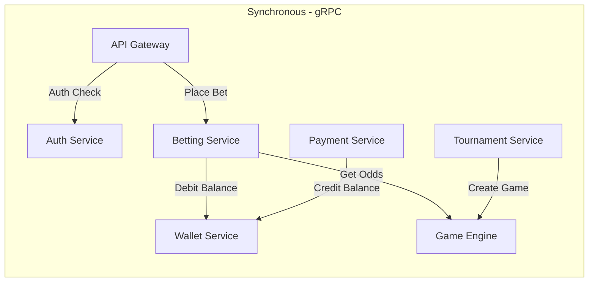
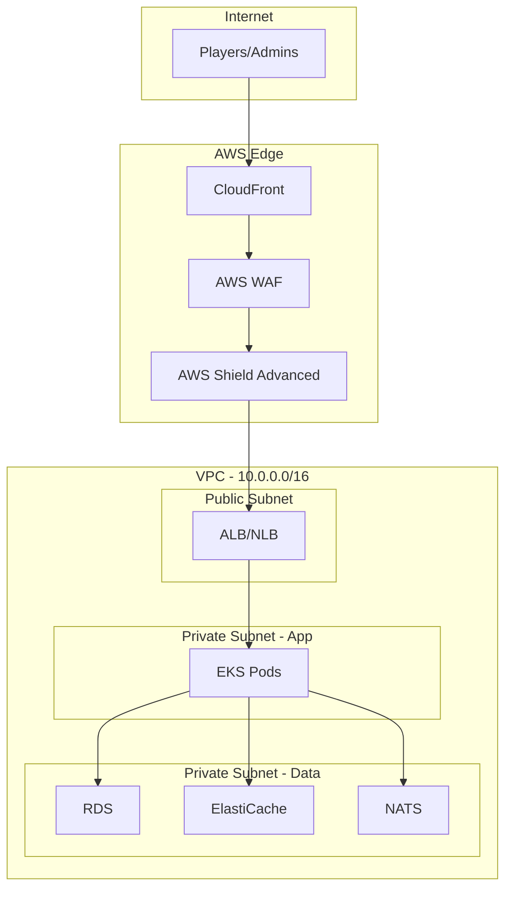
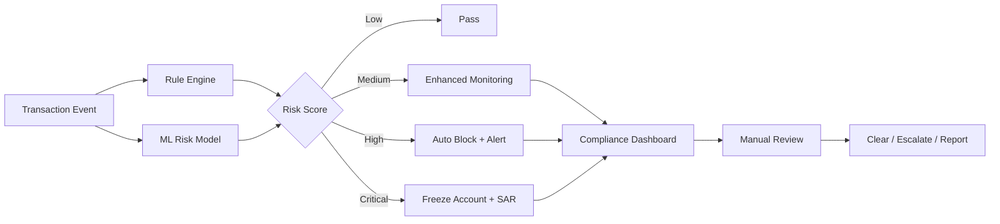
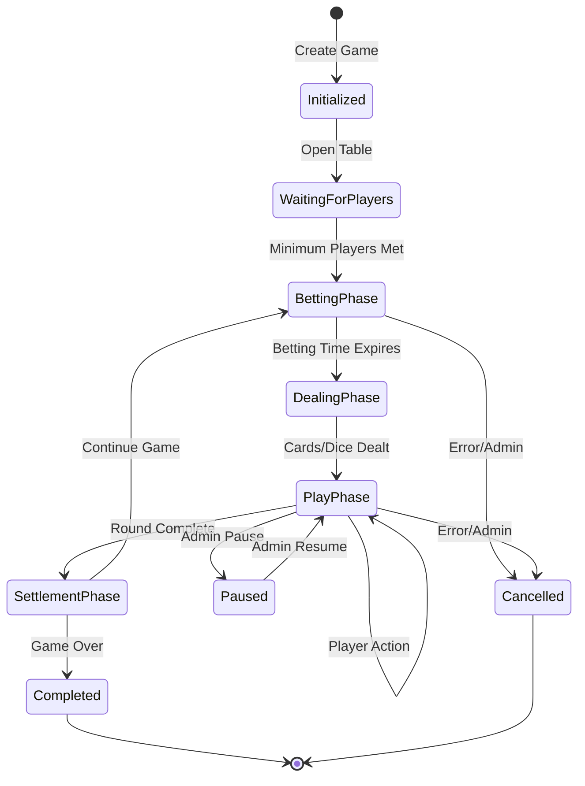
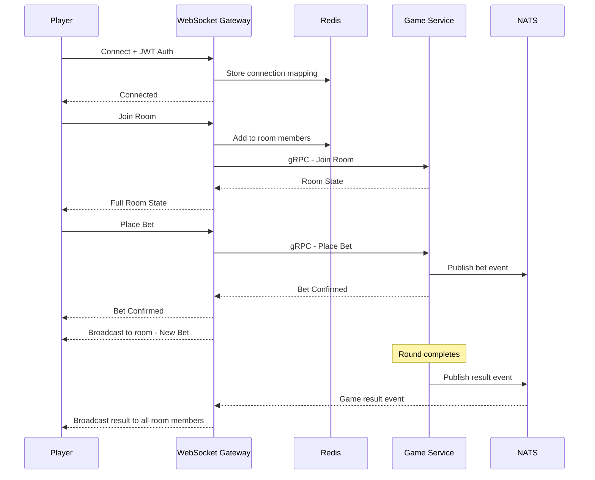
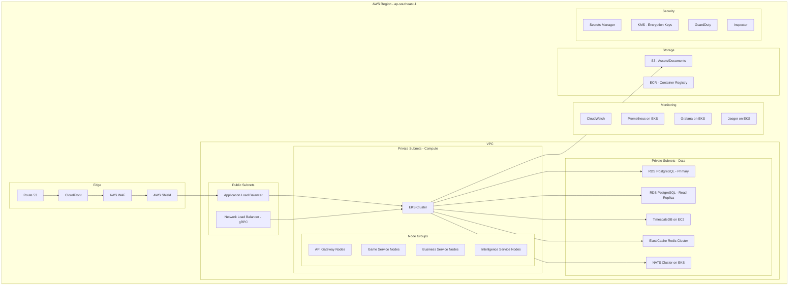
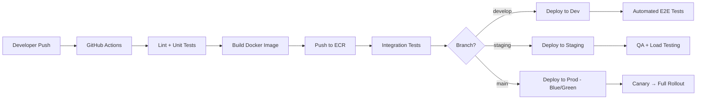

# Casino Game Engine - Complete Architecture Plan

## 1. Executive Summary

A comprehensive online casino game engine platform supporting **Card Games**, **Dice Games**, and **Slot Games** with full betting/winning rules, odds calculation, tournament management, progressive jackpots, and multiplayer support. The system is designed for **100K+ concurrent users** on **AWS** with a **microservices architecture**.

---

## 2. Technology Stack Overview

| Layer | Technology | Purpose |
|-------|-----------|---------|
| Player/Merchant/Admin API Gateways | Golang Hertz | HTTP/REST routing, rate limiting |
| WebSocket Gateway | Elixir Phoenix | Real-time connections, millions concurrent |
| Core Game Services | Golang Kratos | Game engine, wallet, betting, multiplayer |
| Business Services | Java Spring Boot | Payments, KYC, bonuses, affiliates |
| Intelligence Services | Python FastAPI | AML/Fraud ML, analytics, risk scoring |
| Platform Services | NestJS | Admin API, CMS, notifications |
| Primary DB | PostgreSQL 16 | Transactional data, user data |
| Vector DB | pgvector extension | Player behavior embeddings, fraud patterns |
| Time-Series DB | TimescaleDB | Game events, analytics, metrics |
| Cache/Session | Redis Cluster | Session store, leaderboards, real-time state |
| Message Broker | NATS JetStream | Event streaming, service communication |
| Service Mesh | gRPC | Synchronous service-to-service calls |
| Admin Web Panel | React + Tailwind CSS + MUI | Admin/Merchant/Agent dashboards |
| Android App | Kotlin + Jetpack Compose | Player mobile app |
| iOS App | Swift + SwiftUI | Player mobile app |
| Infrastructure | AWS EKS, RDS, ElastiCache | Cloud hosting |

---

## 3. High-Level System Architecture



---

## 4. Microservices Breakdown

### 4.1 Player API Gateway (Golang Hertz)

**Responsibility**: Entry point for player/customer applications (mobile apps, web client).

- **HTTP/REST** routing to player-facing services
- **WebSocket** management for real-time game play
- **JWT validation** and token refresh
- **Rate limiting** per user/IP (player-specific limits)
- **Request/Response transformation** and versioning (v1, v2)
- **Circuit breaker** pattern for downstream failures
- **GeoIP blocking** for restricted jurisdictions
- **Request logging** and correlation ID propagation
- **Player-specific** routing: game services, wallet, betting, tournaments

### 4.2 Admin API Gateway (Golang Hertz)

**Responsibility**: Entry point for admin panel web application.

- **Internal network** access only (VPC/private subnet)
- **JWT validation** with admin role claims
- **IP whitelisting** for admin access
- **Rate limiting** per admin user
- **Full admin service** routing: user management, game config, financial ops, compliance
- **Enhanced audit logging** for all admin actions
- **MFA required** for sensitive operations

### 4.3 Merchant API Gateway (Golang Hertz)

**Responsibility**: Entry point for white-label merchant systems.

- **API key authentication** (merchant-specific keys)
- **Rate limiting** per merchant
- **Merchant-specific** routing: player data, reporting, configuration
- **Multi-tenancy** support (merchant isolation)
- **Webhook delivery** for merchant events
- **Usage quota** enforcement per merchant
- **Separate domain** (e.g., api.merchant-domain.com)

### 4.4 Agent/Affiliate API Gateway (Golang Hertz)

**Responsibility**: Entry point for agent and affiliate portals.

- **API key + JWT** authentication
- **Rate limiting** per agent/affiliate
- **Agent-specific** routing: player management, commission reports, links
- **Affiliate-specific** routing: tracking data, performance reports
- **Limited data access** (only relevant to their downline)
- **Separate domain** (e.g., agents.casino.com)

### 4.5 Shared WebSocket Gateway (Elixir Phoenix)

**Responsibility**: Dedicated WebSocket entry for all real-time connections using Elixir/Phoenix.

- **Technology**: Elixir + Phoenix Framework + Cowboy
- **Why Elixir**:
  - Built on Erlang VM (OTP) - battle-tested for telecom-grade reliability
  - Millions of concurrent connections possible per node
  - Fault-tolerant: actors crash and restart independently
  - Hot code reloading without downtime
  - Native WebSocket support with Channels
- **Unified WebSocket** endpoint for all client types
- **Token-based** authentication (JWT for players, API key for others)
- **Connection routing** to appropriate game/multiplayer services via Phoenix Channels
- **Room/table subscription** management with PubSub
- **Broadcast** capabilities for announcements, leaderboards
- **Redis PubSub** for cross-node communication in cluster

### 4.7 Auth Service (Golang Kratos)

**Responsibility**: Identity, authentication, and authorization.

- **Registration**: Email, phone, social OAuth2 (Google, Apple, Facebook)
- **Login**: Password + 2FA (TOTP, SMS OTP)
- **JWT tokens**: Access token (15min) + Refresh token (7 days)
- **RBAC**: Role-based access control (Super Admin, Admin, Merchant, Agent, Player)
- **Session management**: Multi-device session tracking
- **Device fingerprinting**: Track device changes for fraud detection
- **IP whitelisting**: For admin/merchant access
- **Password policies**: Complexity, rotation, breach detection (HaveIBeenPwned)

### 4.8 User Service (Golang Kratos)

**Responsibility**: User profile and account management.

- **Profile management**: Personal info, preferences, avatar
- **KYC status tracking**: Unverified → Pending → Verified → Enhanced
- **Player segmentation**: VIP levels (Bronze, Silver, Gold, Platinum, Diamond)
- **Self-exclusion**: Responsible gaming controls
- **Deposit/Bet limits**: Daily, weekly, monthly configurable limits
- **Account states**: Active, Suspended, Frozen, Closed, Self-Excluded

### 4.4 Game Engine Service (Golang Kratos)

**Responsibility**: Core game logic orchestration and RNG.

- **Certified RNG**: Cryptographically secure PRNG (Fortuna algorithm) with provably fair verification
- **Game state machine**: Manages game lifecycle (Init → Betting → Playing → Settling → Complete)
- **Game registry**: Dynamic game configuration and management
- **House edge calculation**: Configurable per game type
- **RTP (Return to Player)**: Configurable and auditable per game
- **Game round management**: Unique round IDs, full audit trail
- **Provably fair**: Server seed + client seed + nonce for verification
- **Platform Rake/Commission Engine**:
  - Configurable at **game level** (default for all tables of that game type)
  - Overridable at **table level** (specific table can have different rates)
  - **Fixed amount**: Flat fee deducted from each winning round (e.g., $0.50 per round)
  - **Percentage-based**: Percentage of net win amount (e.g., 5% of net win)
  - **Hybrid**: Percentage with min/max cap (e.g., 5% with $0.25 min, $10 max)
  - **Rake calculation**: Applied at settlement time, deducted from winner payout
  - **Rake tracking**: Per-round, per-table, per-game, per-player rake history
  - **Rake distribution**: Platform revenue, jackpot contribution, loyalty points funding
  - **No-rake conditions**: Configurable (e.g., no rake if pot below threshold)
  - **Rake reports**: Real-time and historical rake revenue dashboards

### 4.5 Card Game Service (Golang Kratos)

**Responsibility**: All card game implementations.

| Game | Type | Multiplayer |
|------|------|-------------|
| Blackjack | Player vs Dealer | Single/Multi seat |
| Poker (Texas Holdem) | Player vs Player | 2-9 players |
| Poker (Omaha) | Player vs Player | 2-9 players |
| Baccarat | Player vs Banker | Single player |
| Three Card Poker | Player vs Dealer | Single player |
| Casino War | Player vs Dealer | Single player |
| Caribbean Stud | Player vs Dealer | Single player |
| Pai Gow Poker | Player vs Dealer | Single player |
| Red Dog | Player vs Dealer | Single player |
| Andar Bahar | Player vs Dealer | Single/Multi |
| Dragon Tiger | Player vs Dealer | Single/Multi |
| Teen Patti | Player vs Player | 2-7 players |

**Core Components:**
- Deck management (shuffle, deal, shoe tracking for multi-deck)
- Hand evaluation engine (rankings, side bets)
- Betting positions (main bet, side bets, insurance)
- Turn management for multiplayer
- Auto-play/strategy advisor

### 4.6 Dice Game Service (Golang Kratos)

**Responsibility**: All dice game implementations.

| Game | Type | Multiplayer |
|------|------|-------------|
| Craps | Table game | Multi player |
| Sic Bo | Player vs House | Single/Multi |
| Hazard | Player vs House | Single player |
| Chuck-a-Luck | Player vs House | Single player |
| Klondike | Player vs House | Single player |
| Bitcoin Dice (Hi-Lo) | Player vs House | Single player |
| Liar's Dice | Player vs Player | 2-6 players |

**Core Components:**
- Dice physics simulation (visual only, RNG-backed)
- Complex bet types (Pass/Don't Pass, Come, Place, Proposition for Craps)
- Odds and payout calculation per bet type
- Multi-round state tracking

### 4.7 Slot Game Service (Golang Kratos)

**Responsibility**: All slot game implementations.

| Type | Description |
|------|-------------|
| Classic 3-Reel | Traditional fruit machines |
| Video 5-Reel | Modern multi-payline slots |
| Megaways | Dynamic reel sizes, 100K+ ways |
| Cluster Pays | Grid-based matching |
| Cascading/Avalanche | Winning symbols replaced |
| Progressive Jackpot | Linked jackpot pools |
| Bonus Buy | Direct feature purchase |

**Core Components:**
- **Reel strip configuration**: Weighted symbol distributions
- **Payline engine**: Fixed paylines, ways-to-win, cluster detection
- **Paytable management**: Symbol values, multipliers, wild substitutions
- **Feature triggers**: Free spins, bonus rounds, gamble feature
- **Volatility control**: Low/Medium/High variance math models
- **RTP verification**: Statistical validation of configured RTP
- **Slot math engine**: Probability calculations, hit frequency

### 4.8 Wallet Service (Golang Kratos)

**Responsibility**: Financial account management with double-entry bookkeeping.

- **Multi-currency wallets**: Fiat (USD, EUR, THB) + Crypto (BTC, ETH, USDT)
- **Balance types**: Real money, Bonus money, Free bet balance
- **Double-entry ledger**: Every transaction has debit + credit entries
- **Transaction types**: Deposit, Withdrawal, Bet, Win, Bonus, Adjustment, Fee
- **Optimistic locking**: Prevent race conditions on balance updates
- **Rollback support**: Compensating transactions for failed operations
- **Balance snapshots**: Periodic snapshots for reconciliation
- **Wagering requirements**: Track bonus playthrough requirements

### 4.9 Betting Service (Golang Kratos)

**Responsibility**: Bet placement, odds calculation, and settlement.

- **Bet types**: Single, Accumulator, System bets
- **Odds formats**: Decimal, Fractional, American, Hong Kong
- **Bet lifecycle**: Placed → Accepted → Active → Settled → Paid
- **Bet limits**: Min/Max per game, per player, per table
- **Bet validation**: Balance check, limit check, game state check
- **Settlement engine**: Automatic settlement based on game results
- **Void/Cancel**: Admin ability to void bets with reason
- **Bet history**: Full audit trail with timestamps

### 4.10 Multiplayer Service (Golang Kratos)

**Responsibility**: Real-time multiplayer game sessions.

- **Room management**: Create, join, leave, spectate
- **Table management**: Seat assignment, minimum/maximum players
- **Turn-based protocol**: Action timeout, auto-fold/auto-play
- **WebSocket communication**: Real-time state synchronization
- **Chat integration**: In-game chat with moderation filters
- **Matchmaking**: Skill-based and stake-based matching
- **Anti-collusion**: Detect coordinated play between players
- **Reconnection handling**: State recovery on disconnect

### 4.11 Tournament Service (Java Spring Boot)

**Responsibility**: Tournament lifecycle management.

- **Tournament types**:
  - Scheduled (fixed start time)
  - Sit-and-Go (starts when full)
  - Freeroll (free entry)
  - Satellite (qualify for bigger tournaments)
  - Re-buy/Add-on
  - Bounty/Knockout
- **Blind structure**: Auto-escalating blind levels
- **Prize pool**: Guaranteed, overlay, percentage-based distribution
- **Leaderboard**: Real-time ranking via Redis sorted sets
- **Table balancing**: Auto-balance tables as players eliminate
- **Late registration**: Configurable late entry window
- **Multi-table tournament (MTT)**: Support for 1000+ player tournaments

### 4.12 Jackpot Service (Golang Kratos)

**Responsibility**: Progressive and fixed jackpot management.

- **Jackpot types**:
  - Fixed (predetermined amount)
  - Progressive Local (single game)
  - Progressive Network (across multiple games)
  - Mystery Jackpot (triggers at random amount)
  - Multi-tier (Mini, Minor, Major, Grand)
- **Contribution model**: Percentage of each bet feeds jackpot pool
- **Seed amount**: Minimum jackpot value after win
- **Trigger mechanism**: Symbol combination or random trigger
- **Winner selection**: RNG-based for mystery jackpots
- **Jackpot history**: Full audit trail
- **Real-time display**: WebSocket broadcast of current values

### 4.13 Payment Service (Java Spring Boot)

**Responsibility**: Payment processing and financial operations.

- **Payment gateways**:
  - Credit/Debit cards (Stripe, Adyen)
  - Bank transfer (local banking APIs)
  - E-wallets (Skrill, Neteller, PayPal)
  - Crypto (Coinbase Commerce, BitPay)
  - Prepaid cards (Paysafecard)
- **Deposit flow**: Initiate → Gateway processing → Confirmation → Wallet credit
- **Withdrawal flow**: Request → Review → AML check → Approval → Payout
- **KYC-gated withdrawals**: First withdrawal requires KYC
- **Withdrawal limits**: Daily, weekly, monthly limits per VIP level
- **Reconciliation**: Daily automated reconciliation with gateways
- **Chargeback handling**: Automated detection and account suspension
- **PCI DSS compliance**: Tokenized card storage, no raw card data

### 4.14 KYC Service (Java Spring Boot)

**Responsibility**: Know Your Customer verification.

- **Document verification**: ID, Passport, Driver License (OCR + manual review)
- **Address verification**: Utility bill, bank statement
- **Liveness check**: Selfie verification
- **Integration**: Third-party KYC providers (Jumio, Onfido, Sumsub)
- **KYC levels**:
  - Level 0: Email verified only
  - Level 1: Basic info + phone verified
  - Level 2: ID document verified
  - Level 3: Enhanced due diligence (source of funds)
- **Auto-trigger**: Configurable thresholds for auto-requesting KYC

### 4.15 Bonus/Promotion Service (Java Spring Boot)

**Responsibility**: Bonus and promotion management.

- **Bonus types**:
  - Welcome bonus (first deposit match)
  - Reload bonus (subsequent deposits)
  - No-deposit bonus
  - Free spins
  - Cashback
  - Referral bonus
  - VIP rewards
  - Tournament prizes
- **Wagering requirements**: Configurable multiplier and eligible games
- **Bonus abuse detection**: Multi-account, bonus hunting patterns
- **Expiry management**: Auto-expire unused bonuses
- **Campaign management**: Scheduled promotions with targeting rules

### 4.16 Affiliate/Agent Service (Java Spring Boot)

**Responsibility**: Multi-tier affiliate and agent management.

- **Agent hierarchy**: Super Agent → Master Agent → Agent → Sub-Agent
- **Commission models**: Revenue share, CPA (Cost Per Acquisition), Hybrid
- **Commission calculation**: Automated monthly/weekly settlements
- **Referral tracking**: Unique referral codes and links
- **Agent wallet**: Separate commission wallet with withdrawal
- **Reporting**: Agent-specific performance dashboards
- **Sub-account management**: Agents can manage their player base

### 4.17 AML Detection Service (Python FastAPI)

**Responsibility**: Anti-Money Laundering compliance.

- **Transaction monitoring**: Real-time and batch analysis
- **Suspicious activity detection**:
  - Structuring (smurfing) detection
  - Rapid deposit-withdrawal patterns
  - Minimal play before withdrawal
  - Round-tripping detection
  - Unusual betting patterns
- **Risk scoring**: ML-based player risk scores using behavioral embeddings (pgvector)
- **Alert generation**: Automated SAR (Suspicious Activity Report) triggers
- **Case management**: Investigation workflow for compliance team
- **Regulatory reporting**: Auto-generate CTR and SAR reports
- **Sanctions screening**: PEP and sanctions list checking
- **Threshold rules**: Configurable monetary thresholds

### 4.18 Fraud Detection Service (Python FastAPI)

**Responsibility**: Real-time fraud prevention.

- **Multi-account detection**: Device fingerprint, IP, email pattern clustering
- **Bot detection**: Behavioral analysis, CAPTCHA triggers
- **Collusion detection**: Coordinated play pattern recognition in poker
- **Bonus abuse detection**: ML model for bonus exploitation patterns
- **Velocity checks**: Transaction frequency anomalies
- **Geo-fence violations**: VPN/Proxy detection
- **Payment fraud**: Card testing, stolen card patterns
- **Real-time scoring**: Sub-100ms fraud score on each transaction
- **Feature store**: Player behavior embeddings stored in pgvector

### 4.19 Risk Scoring Service (Python FastAPI)

**Responsibility**: Unified risk assessment.

- **Player risk profile**: Aggregated score from multiple signals
- **Real-time risk engine**: Rules engine + ML ensemble model
- **Risk factors**: Transaction patterns, device changes, location, play patterns
- **Dynamic limits**: Auto-adjust deposit/bet limits based on risk score
- **Risk categories**: Low, Medium, High, Critical
- **Automated actions**: Auto-suspend, require additional KYC, block withdrawal

### 4.20 Analytics Service (Python FastAPI)

**Responsibility**: Business intelligence and reporting.

- **Real-time dashboards**: Active players, GGR, NGR, deposits, withdrawals
- **Game analytics**: RTP monitoring, popular games, revenue per game
- **Player analytics**: LTV, churn prediction, cohort analysis
- **Financial reports**: P&L, tax reports, reconciliation
- **TimescaleDB**: All events stored as time-series for efficient aggregation
- **Player behavior embeddings**: pgvector for similarity search and segmentation

### 4.21 Admin API Service (NestJS)

**Responsibility**: Back-office API for admin panel.

- **Player management**: View, edit, suspend, freeze accounts
- **Game management**: Enable/disable games, configure RTP, limits
- **Financial management**: Manual adjustments, approve withdrawals
- **Content management**: Banners, promotions, announcements
- **System configuration**: Global settings, maintenance mode
- **Audit logs**: All admin actions logged with user and timestamp
- **Role management**: Granular permission system

### 4.22 Merchant API Service (NestJS)

**Responsibility**: White-label platform management.

- **Merchant onboarding**: Registration, configuration, branding
- **Game catalog management**: Enable/disable games per merchant
- **Merchant-specific settings**: Currencies, limits, bonuses
- **Revenue reporting**: Merchant-specific financial reports
- **API key management**: Secure key rotation
- **Webhook configuration**: Event notifications to merchant systems

### 4.23 Notification Service (NestJS)

**Responsibility**: Multi-channel notification delivery.

- **Channels**: Push notification (FCM/APNs), Email (SES), SMS (Twilio), In-app
- **Templates**: Configurable notification templates with localization
- **Triggers**: Event-driven (bet won, deposit confirmed, KYC approved)
- **Scheduling**: Scheduled promotional notifications
- **Preferences**: User notification preference management
- **Rate limiting**: Prevent notification spam

### 4.24 Chat/Support Service (NestJS)

**Responsibility**: Customer support and in-game chat.

- **Live chat**: Real-time customer support
- **In-game chat**: Table/room chat with profanity filter
- **Ticket system**: Support ticket management
- **Canned responses**: Pre-configured response templates
- **Chat history**: Full conversation storage
- **Escalation**: Auto-escalate based on keywords or sentiment

### 4.25 Sports Betting Service (Java Spring Boot)

**Responsibility**: Full sportsbook alongside casino games.

- **Sports coverage**:
  - Football/Soccer, Basketball, Tennis, Cricket, Baseball, Hockey, MMA/Boxing
  - Esports (CS2, Dota 2, League of Legends, Valorant)
  - Virtual sports (simulated events with RNG outcomes)
- **Market types**:
  - Pre-match markets (match winner, over/under, handicap, correct score)
  - Live/In-play markets (real-time odds during events)
  - Outright/Futures (league winner, tournament winner)
  - Player props (player-specific bets)
  - Specials (entertainment, politics - jurisdiction dependent)
- **Bet types**:
  - Single bets
  - Accumulator/Parlay (multi-selection)
  - System bets (Trixie, Yankee, Lucky 15, etc.)
  - Bet builder (combine selections from same event)
  - Cash out (full and partial)
  - Edit bet (add/remove selections)
- **Odds management**:
  - Third-party odds feed integration (Betradar/Sportradar, BetConstruct, LSports)
  - Manual odds adjustment by traders
  - Margin/overround configuration per sport/market
  - Odds formats: Decimal, Fractional, American, Hong Kong, Malay, Indonesian
  - Auto-suspend on significant odds movement
- **Live betting engine**:
  - Real-time event data feed processing
  - Sub-second odds updates via WebSocket
  - Bet acceptance with odds change tolerance
  - Event timeline and statistics display
  - Live match visualization (pitch tracker, score tracker)
- **Risk management**:
  - Liability monitoring per event/market
  - Max payout limits per bet/event
  - Trader alerts for unusual betting patterns
  - Automatic market suspension triggers
  - Player profiling (sharp vs recreational)
- **Settlement**:
  - Auto-settlement from results feed
  - Manual settlement for special markets
  - Void rules (abandoned events, walkovers)
  - Dead heat rules
  - Rule 4 deductions (horse racing)
- **Platform rake**: Configurable margin built into odds (overround)

### 4.26 Sports Data Feed Service (Golang Kratos)

**Responsibility**: Ingest and normalize third-party sports data.

- **Feed providers**: Sportradar, BetConstruct, LSports (pluggable adapter pattern)
- **Data types**: Fixtures, odds, live scores, statistics, results
- **Real-time processing**: Sub-second latency for live events
- **Data normalization**: Unified data model across providers
- **Caching**: Redis-backed for frequently accessed fixtures/odds
- **Failover**: Multi-provider fallback for reliability
- **Event scheduling**: Fixture management and calendar

### 4.27 Live Dealer Service (Golang Kratos)

**Responsibility**: Live dealer casino games with video streaming.

- **Supported games**:
  - Live Blackjack (7-seat tables)
  - Live Baccarat (squeeze, speed, no-commission variants)
  - Live Roulette (European, American, Lightning)
  - Live Poker (Casino Holdem, Three Card, Caribbean Stud)
  - Live Sic Bo
  - Live Dragon Tiger
  - Live Game Shows (Dream Catcher, Monopoly, Crazy Time style)
- **Video streaming**:
  - Low-latency WebRTC streaming (< 1 second delay)
  - Adaptive bitrate streaming (360p, 720p, 1080p)
  - Multi-camera angles per table
  - CDN distribution for global reach
  - Fallback to HLS/DASH for compatibility
- **Table management**:
  - Table-level configuration (min/max bet, game variant, dealer assignment)
  - Table-level platform rake/commission (configurable fixed or percentage)
  - Seat management (limited seats for Blackjack, unlimited for Baccarat/Roulette)
  - Table scheduling (open/close times, dealer shifts)
  - VIP/Private tables (invitation only, higher limits)
- **Dealer interface**:
  - Dealer tablet/screen application for game control
  - Card/result scanning (OCR or RFID)
  - Manual result entry with verification
  - Dealer performance tracking
- **Game state synchronization**:
  - Real-time game state broadcast to all connected players
  - Betting window management (open/close betting)
  - Result announcement with animation sync
  - Chat between players and dealer
- **Studio integration**:
  - Support for in-house studio setup
  - Third-party live dealer provider integration (Evolution, Pragmatic Play Live, Ezugi)
  - API adapter pattern for provider switching
- **Quality assurance**:
  - Video recording and archival for dispute resolution
  - Game round audit trail with video timestamp correlation
  - Dealer action logging

### 4.28 Leaderboard Service (Golang Kratos)

**Responsibility**: Real-time leaderboards and rankings.

- **Leaderboard types**:
  - Daily/Weekly/Monthly/All-time top winners
  - Biggest win leaderboard
  - Most active players
  - Tournament leaderboards
  - Game-specific leaderboards (per card/dice/slot game)
  - VIP point leaderboards
- **Real-time updates**: Redis sorted sets for instant ranking
- **Historical snapshots**: Archive past leaderboard periods
- **Prize distribution**: Auto-award prizes to top-ranked players at period end
- **Public display**: Feed data to lobby, banners, and mobile apps
- **Anti-gaming**: Prevent leaderboard manipulation (min bet requirements, unique player validation)

### 4.29 Winners Showcase Service (NestJS)

**Responsibility**: Public display of recent winners and big wins.

- **Recent winners feed**: Real-time stream of recent wins across all games
- **Big win highlights**: Curated list of notable wins above threshold
- **Jackpot winners**: Dedicated jackpot winner announcements
- **Winner stories**: Optional player testimonials (with consent)
- **Ticker/Marquee data**: Feed for scrolling winner tickers on lobby and apps
- **Privacy controls**: Anonymize player names (e.g., J***n W.) per player preference
- **Configurable thresholds**: Admin-configurable minimum win amount for display
- **Game-specific feeds**: Winners per game category (cards, dice, slots)

### 4.30 Banner & Announcement Service (NestJS)

**Responsibility**: Dynamic content delivery for promotions and announcements.

- **Banner management**:
  - Hero banners (lobby carousel)
  - Sidebar banners
  - In-game banners
  - Pop-up banners (on login, on deposit, etc.)
  - Interstitial banners
- **Banner targeting**:
  - By player segment (VIP level, deposit history, game preference)
  - By geography (country, language)
  - By device (Android, iOS, Web)
  - By time (scheduled start/end)
- **Announcement system**:
  - System-wide announcements (maintenance, new games, policy changes)
  - Targeted announcements (VIP-only, new player, dormant player)
  - In-app notification bar
  - Push notification integration
- **A/B testing**: Multiple banner variants with performance tracking
- **Analytics**: Impression count, click-through rate, conversion tracking
- **Asset management**: Image/video upload to S3 with CDN delivery

### 4.31 Commission & Revenue Share Service (Java Spring Boot)

**Responsibility**: Multi-tier commission calculation and distribution.

- **Commission models**:
  - **Revenue Share**: Percentage of net gaming revenue (NGR) from referred players
  - **CPA (Cost Per Acquisition)**: Fixed fee per qualified new player
  - **Hybrid**: CPA + Revenue Share combination
  - **Sub-affiliate commission**: Multi-tier commission from sub-affiliate referrals
  - **Turnover commission**: Percentage of total wagering volume
- **Commission tiers**:
  - Tier-based rates (higher volume = higher percentage)
  - VIP player multipliers
  - Game-specific commission rates (slots vs poker vs table games)
- **Calculation engine**:
  - Real-time commission accrual
  - Configurable calculation periods (daily, weekly, bi-weekly, monthly)
  - Negative carryover handling (optional)
  - Deductions: chargebacks, bonus costs, platform fees
- **Settlement**:
  - Automated settlement to agent/affiliate wallet
  - Minimum payout threshold
  - Multiple payout methods (bank transfer, crypto, e-wallet)
  - Commission invoicing and tax documentation
- **Reporting**:
  - Real-time commission dashboard
  - Breakdown by player, game, period
  - Comparison reports (period over period)
  - Exportable reports (CSV, PDF)

### 4.32 Affiliate Program Service (Java Spring Boot)

**Responsibility**: Full affiliate program management beyond basic agent system.

- **Affiliate registration**: Self-service signup with approval workflow
- **Marketing tools**:
  - Unique tracking links with UTM parameters
  - Referral codes (custom and auto-generated)
  - Embeddable widgets and banners
  - Landing page builder (basic templates)
  - QR codes for offline marketing
- **Tracking**:
  - Click tracking with attribution window (30/60/90 days)
  - Registration tracking
  - First deposit tracking (FTD)
  - Lifetime value tracking per referred player
  - Multi-touch attribution (first click, last click)
- **Affiliate tiers**:
  - Bronze, Silver, Gold, Platinum affiliate levels
  - Auto-upgrade based on performance metrics
  - Tier-specific commission rates and perks
- **Sub-affiliate program**:
  - Multi-level referral (affiliate refers affiliates)
  - Configurable depth (2-5 levels)
  - Level-specific commission percentages
- **Compliance**:
  - Affiliate agreement management
  - Prohibited marketing method enforcement
  - Traffic quality monitoring (bot detection)
  - Geo-restriction enforcement for affiliates
- **Communication**:
  - Affiliate newsletter system
  - In-platform messaging
  - Promotional material distribution

### 4.33 Loyalty & VIP Program Service (Golang Kratos)

**Responsibility**: Player retention through loyalty points and VIP benefits.

- **Loyalty points system**:
  - Points earned per wager (configurable rate per game type)
  - Points multiplier events (double points weekends, etc.)
  - Points redemption: convert to bonus money, free spins, merchandise
  - Points expiry: configurable expiration period
- **VIP tiers**:

  | Tier | Points Required | Benefits |
  |------|----------------|----------|
  | Bronze | 0 | Basic access |
  | Silver | 1,000 | 5% cashback, priority support |
  | Gold | 10,000 | 10% cashback, personal account manager |
  | Platinum | 50,000 | 15% cashback, exclusive tournaments, higher limits |
  | Diamond | 200,000 | 20% cashback, custom bonuses, VIP events |

- **VIP benefits**:
  - Enhanced deposit/withdrawal limits
  - Faster withdrawal processing
  - Exclusive game access
  - Birthday bonuses
  - Personal account manager (Platinum+)
  - Exclusive tournament invitations
  - Custom bonus offers
  - Cashback on losses
- **Tier management**:
  - Auto-upgrade based on points accumulation
  - Grace period before downgrade
  - Manual override by admin
- **VIP events**:
  - Exclusive VIP-only tournaments
  - Special promotional events
  - Seasonal campaigns

### 4.34 Referral Program Service (NestJS)

**Responsibility**: Player-to-player referral system.

- **Referral mechanics**:
  - Unique referral link/code per player
  - Shareable via social media, messaging apps, email
  - Deep linking support for mobile apps
- **Reward structure**:
  - Referrer reward: Bonus money or free spins when referee deposits
  - Referee reward: Welcome bonus enhancement
  - Ongoing rewards: Percentage of referee's play (time-limited)
  - Milestone rewards: Bonus for referring 5, 10, 25 players
- **Tracking**:
  - Referral funnel: Click → Register → Deposit → Active
  - Conversion rate analytics
  - Referral leaderboard
- **Anti-abuse**:
  - Self-referral detection
  - Multi-account referral detection
  - Minimum activity requirements for reward unlock
  - IP and device fingerprint validation

---

## 5. Platform Benefits & Engagement - Summary



---

## 6. Database Architecture

### 5.1 PostgreSQL (Primary Transactional DB)

```
Databases:
├── casino_auth        (Auth Service)
│   ├── users
│   ├── credentials
│   ├── sessions
│   ├── roles
│   └── permissions
│
├── casino_users       (User Service)
│   ├── profiles
│   ├── kyc_documents
│   ├── kyc_verifications
│   ├── vip_levels
│   ├── self_exclusions
│   └── user_limits
│
├── casino_wallet      (Wallet Service)
│   ├── wallets
│   ├── ledger_entries
│   ├── transactions
│   ├── balance_snapshots
│   └── pending_transactions
│
├── casino_games       (Game Engine)
│   ├── game_definitions
│   ├── game_configurations
│   ├── game_rounds
│   ├── game_actions
│   ├── rng_seeds
│   └── paytables
│
├── casino_betting     (Betting Service)
│   ├── bets
│   ├── bet_selections
│   ├── settlements
│   └── bet_limits
│
├── casino_tournaments (Tournament Service)
│   ├── tournaments
│   ├── tournament_entries
│   ├── tournament_rounds
│   ├── prize_structures
│   └── leaderboards
│
├── casino_jackpots    (Jackpot Service)
│   ├── jackpot_pools
│   ├── jackpot_contributions
│   ├── jackpot_winners
│   └── jackpot_configurations
│
├── casino_payments    (Payment Service)
│   ├── payment_methods
│   ├── deposits
│   ├── withdrawals
│   ├── gateway_transactions
│   └── reconciliation_records
│
├── casino_bonuses     (Bonus Service)
│   ├── bonus_campaigns
│   ├── player_bonuses
│   ├── wagering_progress
│   └── free_spin_awards
│
├── casino_agents      (Affiliate Service)
│   ├── agents
│   ├── agent_hierarchy
│   ├── commissions
│   └── referral_codes
│
├── casino_compliance  (AML/Fraud)
│   ├── aml_alerts
│   ├── sar_reports
│   ├── fraud_cases
│   ├── sanctions_checks
│   └── risk_scores
│
├── casino_platform    (Admin/CMS)
│   ├── merchant_configs
│   ├── cms_content
│   ├── audit_logs
│   ├── system_configs
│   └── notification_templates
│
├── casino_sports      (Sports Betting)
│   ├── sports
│   ├── competitions
│   ├── fixtures
│   ├── markets
│   ├── odds
│   ├── sports_bets
│   ├── sports_settlements
│   ├── live_events
│   ├── event_statistics
│   ├── cash_out_offers
│   └── trader_adjustments
│
├── casino_live_dealer (Live Dealer)
│   ├── live_tables
│   ├── live_table_configs
│   ├── dealers
│   ├── dealer_shifts
│   ├── live_game_rounds
│   ├── live_game_results
│   ├── video_recordings
│   └── studio_configs
│
├── casino_rake        (Platform Rake/Commission)
│   ├── rake_configurations
│   ├── game_rake_rules
│   ├── table_rake_overrides
│   ├── rake_transactions
│   ├── rake_distributions
│   └── rake_reports
│
├── casino_engagement  (Leaderboards/Winners/Loyalty)
│   ├── leaderboards
│   ├── leaderboard_entries
│   ├── leaderboard_prizes
│   ├── winner_showcases
│   ├── big_win_highlights
│   ├── loyalty_points
│   ├── loyalty_transactions
│   ├── vip_tiers
│   ├── vip_benefits
│   └── vip_tier_history
│
├── casino_affiliates  (Affiliate Program)
│   ├── affiliates
│   ├── affiliate_tiers
│   ├── tracking_links
│   ├── click_tracking
│   ├── attribution_records
│   ├── sub_affiliates
│   └── affiliate_communications
│
├── casino_commissions (Commission & Revenue Share)
│   ├── commission_plans
│   ├── commission_tiers
│   ├── commission_accruals
│   ├── commission_settlements
│   ├── commission_invoices
│   └── negative_carryovers
│
├── casino_referrals   (Player Referral Program)
│   ├── referral_codes
│   ├── referral_tracking
│   ├── referral_rewards
│   └── referral_milestones
│
└── casino_banners     (Banners & Announcements)
    ├── banners
    ├── banner_placements
    ├── banner_targeting_rules
    ├── banner_analytics
    ├── announcements
    └── announcement_targets
```

### 5.2 pgvector (Vector DB Extension)

Used within the compliance database for:
- **Player behavior embeddings** (768-dim vectors): Session patterns, betting patterns
- **Fraud pattern vectors**: Known fraud patterns for similarity search
- **Player similarity search**: Find similar players to flagged accounts
- **Anomaly detection**: Distance-based outlier detection

### 5.3 TimescaleDB (Time-Series)

```
Hypertables:
├── game_events          (All game actions with timestamps)
├── betting_events       (Bet placement and settlement events)
├── financial_events     (Deposits, withdrawals, transfers)
├── player_sessions      (Login, logout, activity tracking)
├── game_metrics         (RTP tracking, house edge actuals)
├── system_metrics       (Service health, latency, throughput)
└── revenue_metrics      (GGR, NGR, per-game revenue)
```

### 5.4 Redis Cluster

```
Key Patterns:
├── session:{user_id}           (User session data, TTL: 24h)
├── game:state:{game_id}        (Active game state, TTL: 4h)
├── room:{room_id}              (Multiplayer room state)
├── table:{table_id}:seats      (Table seat assignments)
├── jackpot:{pool_id}:value     (Current jackpot amount)
├── tournament:{id}:leaderboard (Sorted set for rankings)
├── rate_limit:{ip}:{endpoint}  (Rate limiting counters)
├── user:balance:{user_id}      (Cached wallet balance)
├── lock:wallet:{user_id}       (Distributed lock for wallet ops)
├── rng:seed:{session_id}       (RNG state per session)
├── matchmaking:queue:{stake}   (Matchmaking queues)
├── online:players              (HyperLogLog for unique count)
├── leaderboard:{type}:{period} (Sorted sets for leaderboards)
├── winners:recent              (List of recent winners)
├── winners:big                 (List of big win highlights)
├── loyalty:points:{user_id}    (Cached loyalty points)
├── vip:tier:{user_id}          (Cached VIP tier)
├── banner:active:{placement}   (Active banners per placement)
└── referral:code:{code}        (Referral code lookup cache)
```

---

## 7. Service Communication

### 7.1 gRPC (Synchronous)

Used for request-response patterns requiring immediate results:



**Proto definitions organized by domain:**
- `auth.proto` - Authentication and authorization
- `user.proto` - User profile operations
- `wallet.proto` - Balance operations
- `game.proto` - Game state operations
- `betting.proto` - Bet operations
- `payment.proto` - Payment operations

### 7.2 NATS JetStream (Asynchronous)

Used for event-driven patterns and decoupled communication:

```
Subjects/Streams:
├── game.events.>              (All game events)
│   ├── game.events.round.started
│   ├── game.events.round.completed
│   ├── game.events.bet.placed
│   └── game.events.bet.settled
│
├── player.events.>            (Player lifecycle events)
│   ├── player.events.registered
│   ├── player.events.logged_in
│   ├── player.events.kyc.updated
│   └── player.events.vip.changed
│
├── financial.events.>         (Financial events)
│   ├── financial.events.deposit.completed
│   ├── financial.events.withdrawal.requested
│   └── financial.events.withdrawal.approved
│
├── compliance.events.>        (AML/Fraud events)
│   ├── compliance.events.alert.triggered
│   ├── compliance.events.risk.updated
│   └── compliance.events.sar.filed
│
├── notification.events.>      (Notification triggers)
│   ├── notification.events.push
│   ├── notification.events.email
│   └── notification.events.sms
│
└── jackpot.events.>           (Jackpot events)
    ├── jackpot.events.contribution
    ├── jackpot.events.won
    └── jackpot.events.reset
```

**Consumer Groups:**
- `aml-processor`: Consumes financial and game events for AML analysis
- `fraud-processor`: Consumes all events for fraud scoring
- `analytics-processor`: Consumes all events for TimescaleDB ingestion
- `notification-processor`: Consumes notification triggers

---

## 8. Security Architecture

### 7.1 Network Security



- **AWS WAF**: SQL injection, XSS, bot protection, geo-blocking
- **AWS Shield Advanced**: DDoS protection
- **VPC**: Private subnets for all services, no direct internet access
- **Security Groups**: Least privilege, service-specific ingress rules
- **Network Policies**: Kubernetes network policies for pod-to-pod isolation

### 7.2 Application Security

| Aspect | Implementation |
|--------|---------------|
| Authentication | JWT (RS256) + 2FA (TOTP/SMS) |
| Authorization | RBAC + ABAC with OPA (Open Policy Agent) |
| API Security | Rate limiting, request validation, CORS |
| Data Encryption | AES-256 at rest, TLS 1.3 in transit |
| Secret Management | AWS Secrets Manager + HashiCorp Vault |
| Input Validation | Schema validation on all endpoints |
| SQL Injection | Parameterized queries, ORM usage |
| CSRF Protection | Double-submit cookie pattern |
| XSS Protection | Content Security Policy headers |
| Dependency Scanning | Snyk/Dependabot for vulnerability detection |

### 7.3 Anti-Money Laundering (AML) Pipeline



**AML Rules Engine:**
1. **Structuring Detection**: Multiple deposits just below reporting threshold
2. **Velocity Rules**: Unusual transaction frequency
3. **Minimal Play**: Deposit → minimal wagering → withdrawal
4. **Peer-to-Peer Transfer**: Chip dumping in poker
5. **Geographic Rules**: Transactions from high-risk jurisdictions
6. **Profile Mismatch**: Transaction patterns inconsistent with player profile
7. **Third-Party Deposits**: Deposits from accounts not matching player name

### 7.4 Fraud Prevention Layers

```
Layer 1: Registration
├── Email verification
├── Phone verification  
├── Device fingerprinting
├── IP reputation check
└── CAPTCHA for suspicious registrations

Layer 2: Login
├── 2FA enforcement for high-risk actions
├── Impossible travel detection
├── New device detection → additional verification
├── Brute force protection (account lockout)
└── Session anomaly detection

Layer 3: Transaction
├── Real-time fraud scoring (<100ms)
├── Velocity checks
├── Amount anomaly detection
├── Payment method risk scoring
└── Chargeback prediction model

Layer 4: Gameplay
├── Bot detection (behavioral analysis)
├── Collusion detection (poker)
├── Bonus abuse detection
├── Multi-account detection
└── Pattern manipulation detection

Layer 5: Withdrawal
├── AML screening
├── KYC verification gate
├── Withdrawal delay for first-time
├── Manual review threshold
└── Sanctions list check
```

### 7.5 Responsible Gaming

- **Self-exclusion**: 6 months, 1 year, permanent options
- **Deposit limits**: Daily, weekly, monthly
- **Bet limits**: Per-game and aggregate
- **Loss limits**: Session and period-based
- **Session reminders**: Configurable time alerts
- **Reality checks**: Pop-up showing time spent and net win/loss
- **Cool-off periods**: Temporary account suspension
- **Underage prevention**: Age verification in KYC

---

## 9. Game Engine Core Design

### 8.1 Game State Machine



### 8.2 Provably Fair RNG System

```
Flow:
1. Server generates server_seed (SHA-256 hash)
2. Server sends hash(server_seed) to client BEFORE game
3. Client provides client_seed
4. Game uses HMAC-SHA512(server_seed, client_seed + nonce) for RNG
5. After game, server reveals server_seed
6. Client can verify: hash(revealed_seed) === pre-game hash
7. Full audit log stored in database
```

### 8.3 Slot Math Engine

```
Components:
├── Reel Strip Generator
│   ├── Symbol weight distribution
│   ├── Near-miss control (within regulatory limits)
│   └── Feature trigger probability
│
├── Payline Evaluator
│   ├── Fixed payline matcher
│   ├── Ways-to-win calculator (243/1024/Megaways)
│   ├── Cluster pay detector
│   └── Cascading win processor
│
├── Feature Engine
│   ├── Free spin trigger and execution
│   ├── Bonus round logic
│   ├── Multiplier progression
│   ├── Wild expansion/sticky/walking
│   └── Gamble feature (double or nothing)
│
├── RTP Calculator
│   ├── Theoretical RTP from math model
│   ├── Actual RTP tracking per game instance
│   └── Variance/volatility metrics
│
└── Progressive Jackpot Interface
    ├── Contribution per spin
    ├── Trigger evaluation
    └── Winner notification
```

---

## 10. Real-Time Architecture

### 9.1 WebSocket Communication



### 9.2 Connection Management

- **Sticky sessions**: Redis-backed session affinity
- **Heartbeat**: 30-second ping/pong
- **Reconnection**: 60-second grace period with state recovery
- **Horizontal scaling**: Multiple WebSocket gateway instances with Redis pub/sub
- **Connection limits**: Max connections per user (5), per IP (50)

---

## 11. Admin/Merchant/Agent Web Panel

### 10.1 Tech Stack

- **Framework**: React 18 + TypeScript
- **UI Library**: MUI (Material-UI) v5 + Tailwind CSS
- **State Management**: Redux Toolkit + RTK Query
- **Charts**: Recharts / ApexCharts
- **Tables**: TanStack Table (React Table v8)
- **Forms**: React Hook Form + Zod validation
- **Real-time**: Socket.io client for live updates
- **Auth**: JWT with refresh token rotation

### 10.2 Panel Modules

```
Admin Panel
├── Dashboard
│   ├── Real-time player count
│   ├── GGR/NGR widgets
│   ├── Deposit/Withdrawal charts
│   └── Alert notifications
│
├── Player Management
│   ├── Player list with search/filter
│   ├── Player detail view
│   ├── Account actions (suspend, freeze, adjust)
│   ├── KYC review interface
│   └── Player communication log
│
├── Game Management
│   ├── Game catalog
│   ├── Game configuration (RTP, limits, enable/disable)
│   ├── Table management
│   └── Game performance analytics
│
├── Financial Management
│   ├── Deposit management
│   ├── Withdrawal approval queue
│   ├── Manual adjustments
│   ├── Reconciliation reports
│   └── Revenue reports
│
├── Bonus Management
│   ├── Campaign creation
│   ├── Active campaigns
│   ├── Player bonus tracking
│   └── Bonus performance reports
│
├── Tournament Management
│   ├── Create tournament
│   ├── Tournament monitoring
│   ├── Prize management
│   └── Tournament history
│
├── Compliance
│   ├── AML alerts dashboard
│   ├── Case management
│   ├── SAR filing
│   ├── Risk score overview
│   └── Sanctions screening results
│
├── Agent Management
│   ├── Agent hierarchy tree
│   ├── Commission configuration
│   ├── Commission reports
│   └── Agent performance
│
├── Merchant Management
│   ├── Merchant onboarding
│   ├── Merchant configuration
│   ├── White-label settings
│   └── Merchant reporting
│
├── Sports Betting Management
│   ├── Sports and competition configuration
│   ├── Fixture management
│   ├── Market and odds management
│   ├── Trader dashboard (live odds adjustment)
│   ├── Liability monitoring per event/market
│   ├── Sports bet management and settlement
│   ├── Cash out configuration
│   ├── Data feed provider management
│   └── Sports analytics and reports
│
├── Live Dealer Management
│   ├── Live table configuration (min/max bet, game variant)
│   ├── Dealer management (profiles, shifts, performance)
│   ├── Studio management
│   ├── Table rake/commission configuration
│   ├── Live table monitoring (active players, bets, video)
│   ├── VIP/Private table management
│   ├── Video recording archive and dispute resolution
│   └── Third-party provider integration settings
│
├── Platform Rake Management
│   ├── Game-level rake configuration
│   ├── Table-level rake overrides
│   ├── Rake type settings (fixed, percentage, hybrid)
│   ├── Rake distribution rules (platform, jackpot, loyalty)
│   ├── Rake revenue dashboard
│   └── Rake reports (by game, table, period)
│
├── Leaderboard Management
│   ├── Leaderboard configuration (types, periods, prizes)
│   ├── Active leaderboards monitoring
│   ├── Prize distribution management
│   ├── Leaderboard history and archives
│   └── Anti-gaming rule configuration
│
├── Winners & Showcase
│   ├── Recent winners feed management
│   ├── Big win threshold configuration
│   ├── Jackpot winner announcements
│   ├── Winner ticker configuration
│   └── Privacy settings management
│
├── Banner & Announcements
│   ├── Banner creation and scheduling
│   ├── Banner placement management (hero, sidebar, popup, in-game)
│   ├── Targeting rules configuration
│   ├── A/B test management
│   ├── Banner analytics (impressions, CTR, conversions)
│   ├── System announcements
│   └── Asset library management
│
├── Commission Management
│   ├── Commission plan configuration
│   ├── Tier-based rate management
│   ├── Commission calculation dashboard
│   ├── Settlement management and approval
│   ├── Invoice generation
│   ├── Negative carryover settings
│   └── Commission reports (by agent, game, period)
│
├── Affiliate Program
│   ├── Affiliate registration approval queue
│   ├── Affiliate tier management
│   ├── Marketing material management
│   ├── Tracking link analytics
│   ├── Sub-affiliate tree view
│   ├── Traffic quality monitoring
│   └── Affiliate communication tools
│
├── Loyalty & VIP Program
│   ├── Loyalty points configuration (earn rates per game)
│   ├── Points multiplier event management
│   ├── Redemption catalog management
│   ├── VIP tier configuration (thresholds, benefits)
│   ├── VIP player management
│   ├── VIP event scheduling
│   └── Loyalty program analytics
│
├── Referral Program
│   ├── Referral reward configuration
│   ├── Milestone reward management
│   ├── Referral funnel analytics
│   ├── Anti-abuse monitoring
│   └── Referral leaderboard
│
├── System
│   ├── Role and permission management
│   ├── Audit log viewer
│   ├── System configuration
│   ├── Maintenance mode
│   └── Service health monitoring
│
└── Reports
    ├── Financial reports
    ├── Player reports
    ├── Game reports
    ├── Compliance reports
    ├── Affiliate & Commission reports
    ├── Engagement reports (leaderboards, loyalty, referrals)
    └── Custom report builder
```

---

## 12. Native Mobile Apps

### 12.1 Android (Kotlin)

```
Architecture: MVVM + Clean Architecture
├── Presentation Layer
│   ├── Jetpack Compose UI
│   ├── ViewModels
│   └── Navigation (Compose Navigation)
│
├── Domain Layer
│   ├── Use Cases
│   ├── Repository Interfaces
│   └── Domain Models
│
├── Data Layer
│   ├── Retrofit (REST API)
│   ├── OkHttp (WebSocket)
│   ├── Room DB (local cache)
│   ├── DataStore (preferences)
│   └── Repository Implementations
│
├── Core
│   ├── DI (Hilt/Dagger)
│   ├── Security (Certificate pinning, root detection)
│   ├── Analytics (Firebase)
│   └── Push Notifications (FCM)
│
└── Features
    ├── Auth (Login, Register, 2FA)
    ├── Lobby (Game catalog, search)
    ├── Card Games (game-specific UIs)
    ├── Dice Games (game-specific UIs)
    ├── Slot Games (animated reels)
    ├── Wallet (Deposit, Withdraw, History)
    ├── Tournaments (Browse, Join, Play)
    ├── Profile (Settings, KYC, Limits)
    ├── Chat/Support
    └── Notifications
```

### 12.2 iOS (Swift)

```
Architecture: MVVM + Clean Architecture
├── Presentation Layer
│   ├── SwiftUI Views
│   ├── ViewModels (ObservableObject)
│   └── Navigation (NavigationStack)
│
├── Domain Layer
│   ├── Use Cases
│   ├── Repository Protocols
│   └── Domain Models
│
├── Data Layer
│   ├── Alamofire/URLSession (REST API)
│   ├── Starscream (WebSocket)
│   ├── Core Data (local cache)
│   ├── UserDefaults (preferences)
│   └── Repository Implementations
│
├── Core
│   ├── DI (Swinject/Factory)
│   ├── Security (Certificate pinning, jailbreak detection)
│   ├── Analytics (Firebase)
│   └── Push Notifications (APNs)
│
└── Features
    (Same feature modules as Android)
```

### 12.3 Mobile Security

- **Certificate pinning**: Prevent MITM attacks
- **Root/Jailbreak detection**: Block compromised devices
- **Code obfuscation**: ProGuard (Android), Swift compilation (iOS)
- **Secure storage**: Android Keystore, iOS Keychain
- **App integrity**: Google Play Integrity API, Apple App Attest
- **Anti-tampering**: Runtime integrity checks
- **Screenshot prevention**: Disable screenshots in sensitive areas
- **Clipboard protection**: Clear sensitive data from clipboard

---

## 13. AWS Infrastructure

### 12.1 Architecture



### 12.2 Resource Sizing (100K+ Concurrent Users)

| Component | Specification |
|-----------|--------------|
| EKS Cluster | 3 AZs, managed node groups |
| API Gateway Nodes | c6i.2xlarge x 6 (auto-scale 3-12) |
| Game Service Nodes | c6i.4xlarge x 8 (auto-scale 4-16) |
| Business Service Nodes | m6i.2xlarge x 4 (auto-scale 2-8) |
| Intelligence Service Nodes | r6i.2xlarge x 4 (auto-scale 2-8) |
| RDS PostgreSQL | db.r6i.4xlarge Multi-AZ + 2 Read Replicas |
| TimescaleDB | r6i.2xlarge x 3 (replication) |
| ElastiCache Redis | r6g.2xlarge, 6-node cluster (3 primary + 3 replica) |
| NATS | 3-node JetStream cluster on EKS |

---

## 14. CI/CD Pipeline



**Tools:**
- **Source Control**: GitHub (monorepo or multi-repo)
- **CI/CD**: GitHub Actions
- **Container Registry**: AWS ECR
- **Deployment**: ArgoCD (GitOps) on EKS
- **Infrastructure**: Terraform for AWS resources
- **Helm Charts**: For Kubernetes deployments
- **Testing**: Unit, Integration, E2E, Load (k6)
- **Security Scanning**: Trivy (container), Snyk (dependencies), SonarQube (code quality)

---

## 15. Observability

| Aspect | Tool | Purpose |
|--------|------|---------|
| Metrics | Prometheus + Grafana | Service metrics, business KPIs |
| Logging | Fluentd + OpenSearch | Centralized log aggregation |
| Tracing | Jaeger + OpenTelemetry | Distributed tracing across services |
| Alerts | PagerDuty + Grafana Alerts | Incident management |
| APM | Custom dashboards | Application performance monitoring |
| Uptime | AWS CloudWatch Synthetics | Endpoint monitoring |

---

## 16. Repository Structure

```
game_engine/
├── proto/                          # Shared protobuf definitions
│   ├── auth/
│   ├── user/
│   ├── wallet/
│   ├── game/
│   ├── betting/
│   └── payment/
│
├── services/
│   ├── gateway/                    # Golang Hertz - API Gateway
│   ├── auth-service/               # Golang Kratos
│   ├── user-service/               # Golang Kratos
│   ├── game_engine-service/        # Golang Kratos
│   ├── card-game-service/          # Golang Kratos
│   ├── dice-game-service/          # Golang Kratos
│   ├── slot-game-service/          # Golang Kratos
│   ├── wallet-service/             # Golang Kratos
│   ├── betting-service/            # Golang Kratos
│   ├── multiplayer-service/        # Golang Kratos
│   ├── tournament-service/         # Java Spring Boot
│   ├── jackpot-service/            # Golang Kratos
│   ├── payment-service/            # Java Spring Boot
│   ├── kyc-service/                # Java Spring Boot
│   ├── bonus-service/              # Java Spring Boot
│   ├── agent-service/              # Java Spring Boot
│   ├── aml-service/                # Python FastAPI
│   ├── fraud-service/              # Python FastAPI
│   ├── risk-service/               # Python FastAPI
│   ├── analytics-service/          # Python FastAPI
│   ├── sports-betting-service/       # Java Spring Boot
│   ├── sports-data-feed-service/    # Golang Kratos
│   ├── live-dealer-service/         # Golang Kratos
│   ├── leaderboard-service/         # Golang Kratos
│   ├── loyalty-service/             # Golang Kratos
│   ├── commission-service/          # Java Spring Boot
│   ├── affiliate-service/           # Java Spring Boot
│   ├── admin-api/                   # NestJS
│   ├── merchant-api/                # NestJS
│   ├── notification-service/        # NestJS
│   ├── cms-service/                 # NestJS
│   ├── chat-service/                # NestJS
│   ├── winners-service/             # NestJS
│   ├── banner-service/              # NestJS
│   └── referral-service/            # NestJS
│
├── web/
│   └── admin-panel/                # React + Tailwind + MUI
│
├── mobile/
│   ├── android/                    # Kotlin + Jetpack Compose
│   └── ios/                        # Swift + SwiftUI
│
├── infrastructure/
│   ├── terraform/                  # AWS infrastructure
│   ├── helm/                       # Kubernetes Helm charts
│   ├── docker/                     # Dockerfiles
│   └── k8s/                        # Raw K8s manifests
│
├── docs/
│   ├── api/                        # API documentation
│   ├── architecture/               # Architecture diagrams
│   └── runbooks/                   # Operational runbooks
│
├── scripts/                        # Build and utility scripts
├── .github/                        # GitHub Actions workflows
└── plans/                          # Planning documents
```

---

## 17. Implementation Phases

### Phase 1: Foundation
- Project scaffolding and monorepo setup
- Proto definitions for all services
- Infrastructure setup (Terraform, EKS, RDS, Redis, NATS)
- API Gateway with basic routing
- Auth Service (registration, login, JWT, 2FA)
- User Service (profiles, KYC status)
- Wallet Service (balance, transactions, ledger)
- CI/CD pipeline setup

### Phase 2: Core Game Engine
- Game Engine Service (RNG, state machine, provably fair)
- Card Game Service (Blackjack, Baccarat first)
- Dice Game Service (Hi-Lo, Sic Bo first)
- Slot Game Service (Classic 3-reel, Video 5-reel first)
- Betting Service (single bets, odds, settlement)
- WebSocket Gateway for real-time gameplay
- Basic admin panel (player management, game management)

### Phase 3: Multiplayer and Social
- Multiplayer Service (rooms, tables, matchmaking)
- Poker (Texas Holdem, Omaha) implementation
- Craps (full bet types)
- Tournament Service (Sit-and-Go, Scheduled)
- In-game chat
- Notification Service

### Phase 4: Financial and Compliance
- Payment Service (card, e-wallet, crypto)
- KYC Service (document verification integration)
- AML Detection Service (rules engine)
- Fraud Detection Service (multi-account, bot detection)
- Risk Scoring Service
- Bonus/Promotion Service

### Phase 5: Mobile Apps
- Android app (Kotlin) - core features
- iOS app (Swift) - core features
- Push notifications
- Mobile-specific security (certificate pinning, root detection)

### Phase 6: Platform Benefits & Engagement
- Leaderboard Service (daily/weekly/monthly rankings, prizes)
- Winners Showcase Service (recent winners, big wins, ticker)
- Banner & Announcement Service (targeted banners, A/B testing)
- Commission & Revenue Share Service (multi-tier, automated settlement)
- Affiliate Program Service (tracking links, sub-affiliates, tiers)
- Loyalty & VIP Program Service (points, tiers, redemption)
- Referral Program Service (player-to-player referrals, rewards)
- Admin panel modules for all platform benefits

### Phase 7: Sports Betting
- Sports Data Feed Service (provider integration, data normalization)
- Sports Betting Service (pre-match markets, odds management)
- Live/In-play betting engine (real-time odds, WebSocket updates)
- Cash out and bet builder features
- Sports risk management and trader tools
- Sports-specific admin panel modules

### Phase 8: Live Dealer
- Live Dealer Service (table management, game state sync)
- Video streaming infrastructure (WebRTC, adaptive bitrate)
- Dealer interface application
- Third-party live dealer provider integration (Evolution, Pragmatic Play Live)
- Live table rake/commission configuration
- VIP/Private table support

### Phase 9: Advanced Features
- Progressive Jackpot system
- Megaways/Cluster Pay slot types
- Multi-table tournaments
- Merchant/White-label platform
- Advanced analytics with ML models
- Full admin panel completion

### Phase 10: Hardening and Launch
- Load testing (100K+ concurrent)
- Security audit and penetration testing
- Compliance certification
- RNG audit and certification
- Disaster recovery testing
- Documentation completion
- Production deployment

---

## 18. Key Design Decisions Summary

| Decision | Choice | Reasoning |
|----------|--------|-----------|
| Architecture | Microservices | Independent scaling, team autonomy, polyglot |
| Primary Language | Golang Kratos | Performance for game engine, low latency |
| API Gateway | Golang Hertz | High throughput, native WebSocket support |
| Sync Communication | gRPC | Type safety, low latency, streaming support |
| Async Communication | NATS JetStream | At-least-once delivery, replay, lightweight |
| Primary DB | PostgreSQL | ACID, mature, pgvector extension |
| Time-Series | TimescaleDB | Efficient analytics queries on event data |
| Cache | Redis Cluster | Game state, sessions, leaderboards |
| Container Orchestration | AWS EKS | Managed Kubernetes, auto-scaling |
| Mobile | Native Kotlin/Swift | Best performance for game animations |
| Admin Panel | React + MUI + Tailwind | Rich component library + utility styling |
| Observability | OpenTelemetry stack | Vendor-neutral, comprehensive |
| IaC | Terraform | Multi-cloud capable, declarative |
| CI/CD | GitHub Actions + ArgoCD | GitOps, Kubernetes-native deploys |
