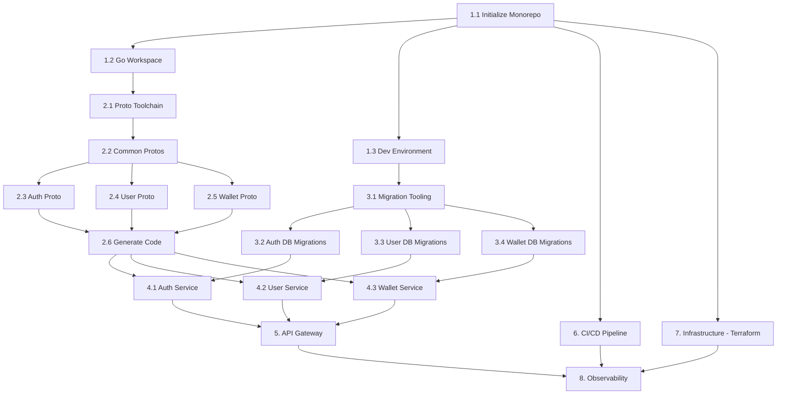

# Phase 1: Foundation - Detailed Implementation Plan

## Overview

Phase 1 establishes the project foundation: monorepo scaffolding, shared protobuf definitions, infrastructure provisioning, core services (Auth, User, Wallet), API Gateway, and CI/CD pipeline. All subsequent phases build on this foundation.

---

## 1. Project Scaffolding & Monorepo Setup

### 1.1 Initialize Monorepo Structure

- Create root `game-engine/` directory with top-level configuration
- Initialize Git repository with `.gitignore` for Go, Java, Python, Node.js, Terraform
- Create directory structure:
  ```
  game-engine/
  ├── proto/
  ├── services/
  │   ├── gateway/
  │   ├── auth-service/
  │   ├── user-service/
  │   └── wallet-service/
  ├── web/
  ├── mobile/
  ├── infrastructure/
  │   ├── terraform/
  │   ├── helm/
  │   ├── docker/
  │   └── k8s/
  ├── docs/
  ├── scripts/
  ├── .github/
  └── plans/
  ```
- Create root `Makefile` with common commands (build, test, lint, proto-gen, docker-build)
- Create root `docker-compose.yml` for local development (PostgreSQL, Redis, NATS, TimescaleDB)
- Create `.editorconfig` for consistent formatting across languages

### 1.2 Initialize Go Workspace

- Create `go.work` file for Go workspace (multi-module monorepo)
- Initialize Go modules for:
  - `services/gateway/` (Hertz framework)
  - `services/auth-service/` (Kratos framework)
  - `services/user-service/` (Kratos framework)
  - `services/wallet-service/` (Kratos framework)
- Create shared Go packages:
  - `pkg/common/` - Shared utilities, error codes, constants
  - `pkg/middleware/` - Common middleware (auth, logging, tracing)
  - `pkg/database/` - Database connection helpers
  - `pkg/redis/` - Redis client wrapper
  - `pkg/nats/` - NATS client wrapper
  - `pkg/crypto/` - Encryption, hashing utilities

### 1.3 Development Environment Configuration

- Create `docker-compose.dev.yml` with:
  - PostgreSQL 16 (port 5432)
  - Redis 7 Cluster (port 6379)
  - NATS with JetStream (port 4222)
  - TimescaleDB (port 5433)
  - pgAdmin (port 5050)
  - RedisInsight (port 8001)
- Create `.env.example` with all required environment variables
- Create `scripts/setup-dev.sh` for first-time developer setup
- Create `scripts/migrate.sh` for database migration runner

---

## 2. Protobuf Definitions

### 2.1 Setup Proto Toolchain

- Create `proto/buf.yaml` (Buf configuration for proto linting and breaking change detection)
- Create `proto/buf.gen.yaml` (code generation config for Go, Java, Python, TypeScript)
- Create `proto/buf.lock` (dependency lock file)
- Install and configure `buf` CLI tool
- Create `scripts/proto-gen.sh` to generate code for all languages

### 2.2 Common Proto Definitions

- `proto/common/v1/pagination.proto` - Pagination request/response
- `proto/common/v1/error.proto` - Standard error response
- `proto/common/v1/money.proto` - Money type (amount + currency)
- `proto/common/v1/timestamp.proto` - Extended timestamp helpers
- `proto/common/v1/enums.proto` - Shared enums (status, currency, etc.)

### 2.3 Auth Service Proto

- `proto/auth/v1/auth_service.proto`:
  - `Register` - Email/phone registration
  - `Login` - Email/phone + password login
  - `RefreshToken` - Token refresh
  - `Logout` - Session invalidation
  - `VerifyEmail` - Email verification
  - `VerifyPhone` - Phone OTP verification
  - `Enable2FA` / `Verify2FA` - TOTP setup and verification
  - `ResetPassword` / `ConfirmResetPassword`
  - `ValidateToken` - Internal token validation (used by gateway)
- `proto/auth/v1/auth_messages.proto` - Request/Response message types

### 2.4 User Service Proto

- `proto/user/v1/user_service.proto`:
  - `GetProfile` - Get user profile
  - `UpdateProfile` - Update user profile
  - `GetKYCStatus` - Get KYC verification status
  - `SubmitKYCDocument` - Submit KYC document
  - `SetDepositLimit` / `SetBetLimit` / `SetLossLimit`
  - `SelfExclude` - Self-exclusion request
  - `GetUserByID` - Internal user lookup
  - `SearchUsers` - Admin user search
- `proto/user/v1/user_messages.proto` - Request/Response message types

### 2.5 Wallet Service Proto

- `proto/wallet/v1/wallet_service.proto`:
  - `GetBalance` - Get wallet balance (real, bonus, free bet)
  - `Credit` - Add funds to wallet
  - `Debit` - Remove funds from wallet
  - `Transfer` - Transfer between balance types
  - `PlaceBet` - Atomic bet placement (debit + lock)
  - `SettleBet` - Settle bet (credit winnings or release lock)
  - `GetTransactionHistory` - Paginated transaction list
  - `GetLedgerEntries` - Double-entry ledger view
  - `CreateWallet` - Initialize wallet for new user
- `proto/wallet/v1/wallet_messages.proto` - Request/Response message types

### 2.6 Generate Code

- Run `buf generate` to produce:
  - Go stubs in `services/*/internal/proto/`
  - Java stubs (for future Spring Boot services)
  - Python stubs (for future FastAPI services)
  - TypeScript stubs (for future NestJS services)

---

## 3. Database Setup & Migrations

### 3.1 Migration Tooling

- Choose and configure migration tool: `golang-migrate` for Go services
- Create migration directory structure per service:
  - `services/auth-service/migrations/`
  - `services/user-service/migrations/`
  - `services/wallet-service/migrations/`
- Create `scripts/migrate.sh` supporting up, down, create, status commands

### 3.2 Auth Service Database (casino_auth)

- Migration 001: Create `users` table
  ```
  id (UUID PK), email, phone, password_hash, email_verified, phone_verified,
  status (active/suspended/frozen/closed), role, created_at, updated_at
  ```
- Migration 002: Create `sessions` table
  ```
  id (UUID PK), user_id (FK), refresh_token_hash, device_fingerprint,
  ip_address, user_agent, expires_at, created_at
  ```
- Migration 003: Create `two_factor_auth` table
  ```
  id (UUID PK), user_id (FK), secret_encrypted, enabled, backup_codes,
  created_at, updated_at
  ```
- Migration 004: Create `roles` and `permissions` tables
  ```
  roles: id, name, description, created_at
  permissions: id, role_id (FK), resource, action, created_at
  ```
- Migration 005: Create `login_attempts` table (for brute force protection)
  ```
  id, user_id, ip_address, success, created_at
  ```
- Create indexes on: email, phone, refresh_token_hash, user_id

### 3.3 User Service Database (casino_users)

- Migration 001: Create `profiles` table
  ```
  id (UUID PK), user_id (FK unique), first_name, last_name, date_of_birth,
  country, currency, language, avatar_url, vip_level, created_at, updated_at
  ```
- Migration 002: Create `kyc_documents` table
  ```
  id (UUID PK), user_id (FK), document_type, document_url, status,
  reviewer_id, review_notes, submitted_at, reviewed_at
  ```
- Migration 003: Create `user_limits` table
  ```
  id (UUID PK), user_id (FK), limit_type (deposit/bet/loss),
  period (daily/weekly/monthly), amount, currency, active, created_at
  ```
- Migration 004: Create `self_exclusions` table
  ```
  id (UUID PK), user_id (FK), duration, reason, starts_at, ends_at, created_at
  ```
- Create indexes on: user_id, country, vip_level

### 3.4 Wallet Service Database (casino_wallet)

- Migration 001: Create `wallets` table
  ```
  id (UUID PK), user_id (FK unique), currency, real_balance (DECIMAL 18,8),
  bonus_balance (DECIMAL 18,8), free_bet_balance (DECIMAL 18,8),
  version (for optimistic locking), created_at, updated_at
  ```
- Migration 002: Create `ledger_entries` table (double-entry)
  ```
  id (UUID PK), wallet_id (FK), transaction_id (FK), entry_type (debit/credit),
  amount (DECIMAL 18,8), balance_type (real/bonus/free_bet),
  balance_before, balance_after, created_at
  ```
- Migration 003: Create `transactions` table
  ```
  id (UUID PK), wallet_id (FK), type (deposit/withdrawal/bet/win/bonus/adjustment),
  amount (DECIMAL 18,8), currency, reference_type, reference_id,
  status (pending/completed/failed/reversed), metadata (JSONB), created_at
  ```
- Migration 004: Create `pending_transactions` table
  ```
  id (UUID PK), wallet_id (FK), type, amount, expires_at, created_at
  ```
- Migration 005: Create `balance_snapshots` table
  ```
  id (UUID PK), wallet_id (FK), real_balance, bonus_balance, free_bet_balance,
  snapshot_at
  ```
- Create indexes on: wallet_id, user_id, transaction type+status, created_at
- Create unique constraint on ledger_entries for idempotency

---

## 4. Core Services Implementation

### 4.1 Auth Service (Golang Kratos)

#### 4.1.1 Project Setup
- Initialize Kratos project: `kratos new auth-service`
- Configure Kratos with:
  - gRPC server (port 9001)
  - HTTP server (port 8001) for health checks
  - Database connection (PostgreSQL)
  - Redis connection (sessions)
  - NATS connection (events)
- Create `configs/config.yaml` with all service configuration
- Create `Dockerfile` for containerization

#### 4.1.2 Registration Flow
- Implement `Register` RPC:
  - Input validation (email format, password complexity, phone format)
  - Check for duplicate email/phone
  - Hash password with bcrypt (cost 12)
  - Create user record in database
  - Generate email verification token
  - Publish `player.events.registered` to NATS
  - Return JWT access token + refresh token
- Unit tests for registration logic
- Integration tests with database

#### 4.1.3 Login Flow
- Implement `Login` RPC:
  - Validate credentials against database
  - Check account status (active, suspended, etc.)
  - Check brute force protection (max 5 attempts per 15 min)
  - If 2FA enabled, return partial token requiring 2FA verification
  - Generate JWT access token (RS256, 15 min expiry)
  - Generate refresh token (opaque, 7 day expiry, stored in Redis)
  - Create session record
  - Publish `player.events.logged_in` to NATS
- Implement `Verify2FA` RPC for TOTP verification
- Unit tests for login logic

#### 4.1.4 Token Management
- Implement `RefreshToken` RPC:
  - Validate refresh token against Redis
  - Rotate refresh token (invalidate old, issue new)
  - Issue new access token
- Implement `ValidateToken` RPC (internal, used by gateway):
  - Verify JWT signature (RS256 public key)
  - Check expiry
  - Return user ID, role, permissions
- Implement `Logout` RPC:
  - Invalidate refresh token in Redis
  - Remove session record

#### 4.1.5 Password Reset
- Implement `ResetPassword` RPC:
  - Generate reset token (UUID, 1 hour expiry)
  - Store in Redis
  - Publish notification event for email delivery
- Implement `ConfirmResetPassword` RPC:
  - Validate reset token
  - Update password hash
  - Invalidate all existing sessions

#### 4.1.6 2FA Setup
- Implement `Enable2FA` RPC:
  - Generate TOTP secret
  - Encrypt and store secret
  - Return QR code URI for authenticator app
- Implement `Verify2FA` RPC:
  - Validate TOTP code against stored secret
  - Generate backup codes (10 codes)
  - Mark 2FA as enabled

### 4.2 User Service (Golang Kratos)

#### 4.2.1 Project Setup
- Initialize Kratos project: `kratos new user-service`
- Configure gRPC (port 9002), HTTP (port 8002)
- Database, Redis, NATS connections
- Create `Dockerfile`

#### 4.2.2 Profile Management
- Implement `GetProfile` RPC:
  - Fetch profile by user_id
  - Include KYC status, VIP level, limits
- Implement `UpdateProfile` RPC:
  - Validate input fields
  - Update profile record
  - Publish `player.events.profile.updated` to NATS

#### 4.2.3 KYC Management
- Implement `GetKYCStatus` RPC:
  - Return current KYC level and pending documents
- Implement `SubmitKYCDocument` RPC:
  - Validate document type
  - Upload document to S3
  - Create kyc_documents record with status "pending"
  - Publish `player.events.kyc.submitted` to NATS

#### 4.2.4 Responsible Gaming
- Implement `SetDepositLimit` / `SetBetLimit` / `SetLossLimit` RPCs:
  - Validate limit values
  - Store in user_limits table
  - Publish limit change event
- Implement `SelfExclude` RPC:
  - Set exclusion period
  - Update user status
  - Publish `player.events.self_excluded` to NATS

#### 4.2.5 Admin Operations
- Implement `SearchUsers` RPC:
  - Paginated search with filters (email, phone, status, VIP level)
- Implement `GetUserByID` RPC:
  - Internal lookup for other services

### 4.3 Wallet Service (Golang Kratos)

#### 4.3.1 Project Setup
- Initialize Kratos project: `kratos new wallet-service`
- Configure gRPC (port 9003), HTTP (port 8003)
- Database, Redis, NATS connections
- Create `Dockerfile`

#### 4.3.2 Wallet Creation
- Implement `CreateWallet` RPC:
  - Called when user registers (via NATS event consumer)
  - Create wallet with zero balances
  - Create initial ledger entry

#### 4.3.3 Balance Operations
- Implement `GetBalance` RPC:
  - Return real_balance, bonus_balance, free_bet_balance
  - Use Redis cache with 5-second TTL, fallback to DB
- Implement `Credit` RPC:
  - Acquire distributed lock (Redis, 10s TTL)
  - Begin database transaction
  - Update wallet balance with optimistic locking (version check)
  - Create ledger entries (debit source, credit wallet)
  - Create transaction record
  - Commit transaction
  - Invalidate Redis cache
  - Release lock
  - Publish `financial.events.credit` to NATS
- Implement `Debit` RPC:
  - Same flow as Credit but with balance sufficiency check
  - Reject if insufficient balance
  - Publish `financial.events.debit` to NATS

#### 4.3.4 Bet Operations (Atomic)
- Implement `PlaceBet` RPC:
  - Acquire distributed lock
  - Check balance sufficiency
  - Debit bet amount from wallet
  - Create pending_transaction record
  - Create ledger entries
  - Return bet transaction ID
  - Publish `game.events.bet.placed` to NATS
- Implement `SettleBet` RPC:
  - If win: Credit winnings to wallet, remove pending_transaction
  - If loss: Remove pending_transaction (already debited)
  - If void: Credit original bet amount back
  - Create settlement ledger entries
  - Publish `game.events.bet.settled` to NATS

#### 4.3.5 Transaction History
- Implement `GetTransactionHistory` RPC:
  - Paginated list with filters (type, date range, status)
- Implement `GetLedgerEntries` RPC:
  - Double-entry ledger view for auditing

#### 4.3.6 Balance Snapshots
- Create scheduled job (cron):
  - Every hour, snapshot all wallet balances
  - Store in balance_snapshots table
  - Used for reconciliation

---

## 5. API Gateways (Golang Hertz + Elixir Phoenix)

Phase 1 implements **4 separate API Gateways** for security isolation and role-based access control, plus a dedicated **Elixir WebSocket Gateway**.

### 5.1 Player API Gateway (Golang Hertz)

**Purpose**: Entry point for player/customer applications (mobile apps, web client)

- **Port**: 8080 (HTTP), 8443 (HTTPS)
- **Public exposure**: Yes (internet-facing)
- **Authentication**: JWT (access + refresh tokens)
- **Routes**:
  - `/api/v1/auth/*` → Auth Service
  - `/api/v1/users/*` → User Service
  - `/api/v1/wallet/*` → Wallet Service
  - `/api/v1/games/*` → Game Engine Services
  - `/api/v1/betting/*` → Betting Service
  - `/api/v1/tournaments/*` → Tournament Service
  - `/api/v1/bonuses/*` → Bonus Service

### 5.2 Admin API Gateway (Golang Hertz)

**Purpose**: Entry point for admin panel web application

- **Port**: 8081 (HTTP), 8444 (HTTPS)
- **Public exposure**: No (VPC/internal only)
- **Authentication**: JWT + MFA required
- **IP Whitelisting**: Configurable admin IP ranges
- **Routes**:
  - `/api/v1/admin/players/*` → User Service (admin operations)
  - `/api/v1/admin/games/*` → Game Engine (config)
  - `/api/v1/admin/financial/*` → Wallet + Payment (admin ops)
  - `/api/v1/admin/compliance/*` → AML/Fraud Services
  - `/api/v1/admin/tournaments/*` → Tournament Service
  - `/api/v1/admin/reports/*` → Analytics Service

### 5.3 Merchant API Gateway (Golang Hertz)

**Purpose**: Entry point for white-label merchant systems

- **Port**: 8082 (HTTP), 8445 (HTTPS)
- **Public exposure**: Yes (custom domains)
- **Authentication**: API Key (merchant-specific)
- **Rate Limiting**: Per merchant (configurable quota)
- **Routes**:
  - `/api/v1/merchant/players/*` → Player data (merchant-specific)
  - `/api/v1/merchant/reports/*` → Revenue reports
  - `/api/v1/merchant/config/*` → Merchant configuration
  - `/api/v1/merchant/webhooks/*` → Event webhooks

### 5.4 Agent/Affiliate API Gateway (Golang Hertz)

**Purpose**: Entry point for agent and affiliate portals

- **Port**: 8083 (HTTP), 8446 (HTTPS)
- **Public exposure**: Yes (agent portal domain)
- **Authentication**: API Key + JWT
- **Rate Limiting**: Per agent/affiliate
- **Routes**:
  - `/api/v1/agent/players/*` → Downline player management
  - `/api/v1/agent/commissions/*` → Commission reports
  - `/api/v1/affiliate/tracking/*` → Click/registration tracking
  - `/api/v1/affiliate/reports/*` → Performance reports

### 5.5 WebSocket Gateway (Elixir Phoenix)

**Purpose**: Unified real-time connections for all client types using Elixir/Phoenix

- **Technology**: Elixir + Phoenix + Cowboy
- **Why Elixir**:
  - Built on Erlang VM (OTP) - battle-tested for telecom reliability
  - Millions of concurrent connections per node
  - Fault-tolerant actors with automatic restarts
  - Hot code reloading without downtime
  - Native WebSocket with Phoenix Channels
- **Port**: 8084 (WS), 8085 (WSS)
- **Public exposure**: Yes (for players)
- **Authentication**: JWT (players), API Key (internal)
- **Features**:
  - Game state synchronization
  - Multiplayer room management (via PubSub)
  - Chat functionality
  - Live dealer streams
  - Tournament updates
  - Leaderboard broadcasts

### 5.6 Shared Gateway Features

All gateways share these common features:

- **Middleware Chain**:
  1. Request ID (correlation ID)
  2. Structured Logger
  3. Panic Recovery
  4. CORS (configurable per gateway)
  5. Rate Limiter (gateway-specific limits)
  6. Authentication (gateway-specific)
  7. Request Validation

- **Error Handling**: Standardized format across all gateways

- **Health Checks**:
  - `/health` - Liveness
  - `/ready` - Readiness (includes dependency checks)

- **TLS/SSL**: All gateways use TLS 1.3

### 5.7 Gateway Infrastructure

```
                                    ┌─────────────────────┐
                                    │   CloudFront CDN   │
                                    └──────────┬──────────┘
                                               │
                    ┌───────────────────────────┼───────────────────────────┐
                    │                           │                           │
           ┌────────▼────────┐        ┌────────▼────────┐        ┌────────▼────────┐
           │ Player Gateway  │        │Merchant Gateway │        │ Agent Gateway  │
           │   :8080/8443   │        │   :8082/8445   │        │   :8083/8446   │
           └───────┬────────┘        └───────┬────────┘        └───────┬────────┘
                   │                        │                        │
                   │    ┌───────────────────┴───────────────────┐    │
                   │    │            Internal VPC               │    │
                   │    │  ┌──────────┐  ┌──────────┐        │    │
                   │    │  │ Admin GW  │  │WebSocket │        │    │
                   │    │  │:8081/8444│  │  :8084   │        │    │
                   │    │  └────┬─────┘  └────┬─────┘        │    │
                   │    │       │             │              │    │
                   └────┼──────┼─────────────┼──────────────┼────┘
                        │      │             │              │
                        ▼      ▼             ▼              ▼
                   ┌─────────────────────────────────────────────────────┐
                   │              Internal Services (gRPC)               │
                   │  Auth │ User │ Wallet │ Game │ Betting │ Payment ... │
                   └─────────────────────────────────────────────────────┘
```

---

## 6. CI/CD Pipeline Setup

### 6.1 GitHub Actions Workflows

#### 6.1.1 Proto Lint & Generate
- `.github/workflows/proto.yml`:
  - Trigger: Changes to `proto/` directory
  - Steps: buf lint, buf breaking (against main), buf generate
  - Upload generated code as artifact

#### 6.1.2 Go Services CI
- `.github/workflows/go-ci.yml`:
  - Trigger: Changes to `services/gateway/`, `services/auth-service/`, etc.
  - Steps:
    1. Setup Go 1.22+
    2. Run `go vet`
    3. Run `golangci-lint`
    4. Run unit tests with coverage
    5. Run integration tests (with Docker Compose services)
    6. Build Docker image
    7. Push to ECR (on main/develop only)
    8. Run Trivy container scan

#### 6.1.3 Deploy Workflow
- `.github/workflows/deploy.yml`:
  - Trigger: Push to develop (→ dev), staging (→ staging), main (→ prod)
  - Steps:
    1. Build and push Docker images
    2. Update Helm chart values
    3. Trigger ArgoCD sync

### 6.2 Docker Configuration

- Create `Dockerfile` for each Go service (multi-stage build):
  ```
  Stage 1: Build (golang:1.22-alpine)
  Stage 2: Runtime (alpine:3.19, non-root user)
  ```
- Create `docker-compose.yml` for local development
- Create `docker-compose.test.yml` for integration tests

### 6.3 Helm Charts (Initial)

- Create `infrastructure/helm/` with base chart:
  - `Chart.yaml`
  - `values.yaml` (default values)
  - `values-dev.yaml`, `values-staging.yaml`, `values-prod.yaml`
  - Templates: Deployment, Service, ConfigMap, Secret, HPA, PDB
- Create per-service value overrides

---

## 7. Infrastructure Setup (Terraform)

### 7.1 AWS Foundation

- `infrastructure/terraform/modules/vpc/`:
  - VPC with 3 AZs
  - Public subnets (ALB)
  - Private subnets (EKS nodes)
  - Private subnets (databases)
  - NAT Gateways
  - VPC Flow Logs

### 7.2 EKS Cluster

- `infrastructure/terraform/modules/eks/`:
  - EKS cluster (Kubernetes 1.29)
  - Managed node groups (initial: 3 nodes, c6i.xlarge)
  - OIDC provider for IAM roles for service accounts
  - CoreDNS, kube-proxy, VPC CNI add-ons
  - Cluster autoscaler

### 7.3 Databases

- `infrastructure/terraform/modules/rds/`:
  - RDS PostgreSQL 16 (db.r6i.xlarge, Multi-AZ)
  - Enable pgvector extension
  - Automated backups (7 day retention)
  - Parameter group with optimized settings
- `infrastructure/terraform/modules/elasticache/`:
  - ElastiCache Redis 7 (cache.r6g.large, 3-node cluster)
  - Encryption at rest and in transit
  - Auth token

### 7.4 NATS

- Deploy NATS with JetStream on EKS via Helm chart
- 3-node cluster for HA
- Persistent storage for JetStream

### 7.5 Supporting Services

- `infrastructure/terraform/modules/ecr/`:
  - ECR repositories for each service
- `infrastructure/terraform/modules/s3/`:
  - S3 bucket for KYC documents, assets
  - Lifecycle policies
- `infrastructure/terraform/modules/secrets/`:
  - AWS Secrets Manager for database credentials, API keys

---

## 8. Observability Foundation

### 8.1 Structured Logging
- Configure all Go services with `zap` structured logger
- Log format: JSON with fields: timestamp, level, service, request_id, user_id, message
- Log levels: DEBUG (dev), INFO (staging/prod), WARN, ERROR

### 8.2 Metrics
- Add Prometheus metrics to all services:
  - Request count, latency histogram, error rate
  - gRPC method metrics
  - Database connection pool metrics
  - Redis operation metrics
- Deploy Prometheus + Grafana on EKS

### 8.3 Distributed Tracing
- Integrate OpenTelemetry SDK in all Go services
- Propagate trace context across gRPC calls
- Export traces to Jaeger (deployed on EKS)

### 8.4 Health Monitoring
- Kubernetes liveness and readiness probes for all services
- Grafana dashboards for service health

---

## Phase 1 Task Dependency Graph



---

## Phase 1 Completion Criteria

- [ ] All 4 Go services (Gateway, Auth, User, Wallet) are running and passing health checks
- [ ] gRPC communication between Gateway ↔ Auth/User/Wallet is functional
- [ ] User can register, login, get JWT, refresh token, and logout
- [ ] User can view and update profile
- [ ] Wallet can credit, debit, place bet, settle bet with double-entry ledger
- [ ] All database migrations applied successfully
- [ ] Proto definitions compile and generate code for all target languages
- [ ] Docker images build and run for all services
- [ ] CI pipeline runs lint, test, build on PR
- [ ] Local development environment works with docker-compose
- [ ] Terraform provisions VPC, EKS, RDS, ElastiCache (dev environment)
- [ ] Basic Prometheus metrics and structured logging in all services
- [ ] NATS JetStream running with event publishing from all services
