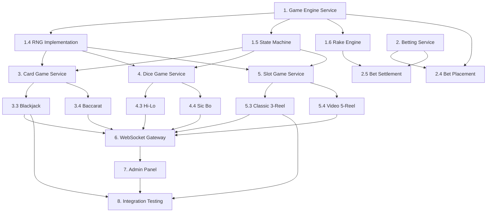

# Phase 2: Core Game Engine - Detailed Implementation Plan

## Overview

Phase 2 builds the core game engine on top of the Phase 1 foundation. This includes the Game Engine Service (RNG, state machine, provably fair), initial Card Games (Blackjack, Baccarat), initial Dice Games (Hi-Lo, Sic Bo), initial Slot Games (Classic 3-Reel, Video 5-Reel), the Betting Service, WebSocket Gateway for real-time gameplay, and the basic Admin Panel.

**Prerequisites**: All Phase 1 services (Auth, User, Wallet, Gateway) must be operational.

---

## 1. Game Engine Service (Golang Kratos)

### 1.1 Project Setup
- Initialize Kratos project: `kratos new game-engine-service`
- Configure gRPC (port 9004), HTTP (port 8004)
- Database connection (casino_games DB)
- Redis connection (game state cache)
- NATS connection (game events)
- Create `Dockerfile`

### 1.2 Protobuf Definitions

- `proto/game/v1/game_service.proto`:
  - `CreateGame` - Initialize a new game instance
  - `GetGameState` - Get current game state
  - `PerformAction` - Player action (hit, stand, roll, spin, etc.)
  - `GetGameHistory` - Past game rounds
  - `GetGameConfig` - Game configuration (RTP, limits, rake)
  - `ListGames` - Available games catalog
  - `UpdateGameConfig` - Admin: update game settings
- `proto/game/v1/game_messages.proto` - All message types
- `proto/game/v1/rng.proto` - RNG-related messages (seeds, verification)

### 1.3 Database Migrations (casino_games)

- Migration 001: Create `game_definitions` table
  ```
  id (UUID PK), name, slug, type (card/dice/slot), subtype,
  description, thumbnail_url, min_bet, max_bet, default_rtp,
  house_edge, status (active/inactive/maintenance),
  config (JSONB - game-specific configuration),
  created_at, updated_at
  ```
- Migration 002: Create `game_configurations` table
  ```
  id (UUID PK), game_definition_id (FK), merchant_id (nullable),
  rtp, min_bet, max_bet, max_payout, currency,
  rake_type (none/fixed/percentage/hybrid),
  rake_fixed_amount, rake_percentage, rake_min_cap, rake_max_cap,
  config_overrides (JSONB), active, created_at, updated_at
  ```
- Migration 003: Create `game_rounds` table
  ```
  id (UUID PK), game_definition_id (FK), table_id (nullable),
  player_id, status (init/betting/playing/settling/completed/cancelled),
  server_seed_hash, server_seed (revealed after round),
  client_seed, nonce, result (JSONB),
  total_bet, total_win, rake_amount,
  started_at, completed_at, created_at
  ```
- Migration 004: Create `game_actions` table
  ```
  id (UUID PK), game_round_id (FK), player_id, action_type,
  action_data (JSONB), result_data (JSONB),
  sequence_number, created_at
  ```
- Migration 005: Create `rng_seeds` table
  ```
  id (UUID PK), game_round_id (FK), server_seed_encrypted,
  server_seed_hash, client_seed, nonce,
  combined_hash, verified, created_at
  ```
- Migration 006: Create `paytables` table
  ```
  id (UUID PK), game_definition_id (FK), version,
  paytable_data (JSONB - symbol values, paylines, etc.),
  rtp_theoretical, active, created_at
  ```
- Migration 007: Create `rake_transactions` table
  ```
  id (UUID PK), game_round_id (FK), game_definition_id (FK),
  table_id (nullable), player_id, bet_amount, win_amount,
  net_win, rake_amount, rake_type, rake_config (JSONB),
  distribution (JSONB - platform/jackpot/loyalty split),
  created_at
  ```

### 1.4 Certified RNG Implementation

- Implement Fortuna CSPRNG (Cryptographically Secure PRNG):
  - Seed from `crypto/rand` (OS entropy source)
  - Re-seed periodically (every 1MB of output or 10 minutes)
  - Thread-safe implementation with mutex
- Implement provably fair system:
  1. Generate `server_seed` (32 bytes random)
  2. Compute `server_seed_hash = SHA-256(server_seed)`
  3. Send `server_seed_hash` to client before game starts
  4. Accept `client_seed` from client
  5. For each random number: `HMAC-SHA512(server_seed, client_seed + ":" + nonce)`
  6. Convert HMAC output to required range (cards, dice values, reel positions)
  7. After round: reveal `server_seed` for client verification
- Implement RNG output converters:
  - `RandomCard()` - Returns card (suit + rank) from deck
  - `RandomDice(sides)` - Returns dice value 1-N
  - `RandomFloat()` - Returns float 0.0-1.0 for slot reels
  - `RandomInt(min, max)` - Returns integer in range
  - `ShuffleDeck(deck)` - Fisher-Yates shuffle using RNG

### 1.5 Game State Machine

- Implement generic state machine framework:
  ```
  States: Init → WaitingForPlayers → BettingPhase → DealingPhase → 
          PlayPhase → SettlementPhase → Completed
  ```
- State transitions with validation:
  - Each transition has preconditions and postconditions
  - Invalid transitions return error
  - State changes published to NATS
- Game state stored in Redis (active games) with DB persistence on completion
- Implement state recovery for crash scenarios (load from Redis or DB)

### 1.6 Platform Rake Engine

- Implement rake calculation at settlement time:
  - Load rake config: game-level default → table-level override
  - Calculate rake based on type:
    - **Fixed**: `rake = fixed_amount` (if net_win > 0)
    - **Percentage**: `rake = net_win * percentage / 100`
    - **Hybrid**: `rake = max(min_cap, min(max_cap, net_win * percentage / 100))`
  - Apply no-rake conditions (configurable threshold)
  - Deduct rake from winner payout
  - Create rake_transaction record
  - Distribute rake: platform_share + jackpot_contribution + loyalty_funding
  - Publish `game.events.rake.collected` to NATS

### 1.7 Game Round Lifecycle

- Implement complete round flow:
  1. `CreateGame` → Generate server_seed, create game_round record
  2. Accept client_seed from player
  3. Accept bets (via Betting Service → Wallet Service debit)
  4. Execute game logic (card deal, dice roll, slot spin)
  5. Determine result
  6. Calculate rake
  7. Settle bets (via Betting Service → Wallet Service credit)
  8. Reveal server_seed
  9. Mark round as completed
  10. Publish game events to NATS

---

## 2. Betting Service (Golang Kratos)

### 2.1 Project Setup
- Initialize Kratos project: `kratos new betting-service`
- Configure gRPC (port 9005), HTTP (port 8005)
- Database (casino_betting), Redis, NATS
- Create `Dockerfile`

### 2.2 Protobuf Definitions

- `proto/betting/v1/betting_service.proto`:
  - `PlaceBet` - Place a bet on a game round
  - `SettleBet` - Settle a bet (win/loss/void)
  - `CashOut` - Early cash out (for applicable games)
  - `GetBetHistory` - Player bet history
  - `GetBetDetails` - Single bet details
  - `VoidBet` - Admin: void a bet
  - `GetBetLimits` - Get min/max bet limits for a game
- `proto/betting/v1/betting_messages.proto`

### 2.3 Database Migrations (casino_betting)

- Migration 001: Create `bets` table
  ```
  id (UUID PK), player_id, game_round_id, game_definition_id,
  table_id (nullable), bet_type (main/side/insurance),
  bet_position (JSONB - game-specific position data),
  amount (DECIMAL 18,8), currency, odds (DECIMAL 10,4),
  potential_payout (DECIMAL 18,8),
  status (placed/accepted/active/settled/voided/cashed_out),
  result (win/loss/push/void), payout_amount (DECIMAL 18,8),
  wallet_transaction_id, settlement_transaction_id,
  placed_at, settled_at, created_at
  ```
- Migration 002: Create `bet_limits` table
  ```
  id (UUID PK), game_definition_id (FK), table_id (nullable),
  bet_type, min_bet, max_bet, max_payout, currency,
  active, created_at, updated_at
  ```
- Migration 003: Create `settlements` table
  ```
  id (UUID PK), bet_id (FK), game_round_id, result_data (JSONB),
  gross_payout, rake_deduction, net_payout,
  settled_by (system/admin), reason, created_at
  ```

### 2.4 Bet Placement Flow

- Implement `PlaceBet` RPC:
  1. Validate bet: game exists, round in betting phase, bet type valid
  2. Check bet limits (min/max per game, per player)
  3. Check player limits (daily/weekly/monthly bet limits from User Service)
  4. Calculate potential payout based on odds
  5. Call Wallet Service `PlaceBet` gRPC (atomic debit)
  6. Create bet record with status "accepted"
  7. Publish `game.events.bet.placed` to NATS
  8. Return bet confirmation with bet ID

### 2.5 Bet Settlement Flow

- Implement `SettleBet` RPC:
  1. Receive game result from Game Engine Service
  2. Evaluate each bet against result
  3. Calculate payout (including rake deduction)
  4. For wins: Call Wallet Service `SettleBet` (credit winnings)
  5. For losses: Call Wallet Service `SettleBet` (release lock)
  6. For push: Call Wallet Service `SettleBet` (return original bet)
  7. Update bet status and payout amount
  8. Create settlement record
  9. Publish `game.events.bet.settled` to NATS

### 2.6 Bet History & Admin

- Implement `GetBetHistory` RPC: Paginated with filters
- Implement `GetBetDetails` RPC: Full bet details with settlement info
- Implement `VoidBet` RPC (admin only): Void bet and refund

---

## 3. Card Game Service (Golang Kratos)

### 3.1 Project Setup
- Initialize Kratos project: `kratos new card-game-service`
- Configure gRPC (port 9006), HTTP (port 8006)
- Redis (game state), NATS (events)
- Create `Dockerfile`

### 3.2 Shared Card Game Components

#### 3.2.1 Deck Manager
- Implement `Deck` struct:
  - Standard 52-card deck
  - Multi-deck shoe support (1, 2, 4, 6, 8 decks)
  - Shuffle using Game Engine RNG
  - Deal card (remove from deck)
  - Shoe penetration tracking (reshuffle point)
  - Burn card support

#### 3.2.2 Hand Evaluator
- Implement card value calculation per game type
- Implement hand ranking (for poker variants)
- Implement comparison logic (player vs dealer)

#### 3.2.3 Card Game State
- Extend base game state machine for card games:
  - Track dealt cards per player/dealer
  - Track current turn
  - Track available actions per state

### 3.3 Blackjack Implementation

#### 3.3.1 Game Configuration
```json
{
  "decks": 6,
  "dealer_stands_on": "soft17",
  "blackjack_pays": "3:2",
  "insurance_pays": "2:1",
  "double_after_split": true,
  "resplit_aces": false,
  "max_splits": 3,
  "surrender": "late",
  "min_bet": 1.00,
  "max_bet": 5000.00,
  "seats": 7
}
```

#### 3.3.2 Game Flow
1. **Betting Phase**: Players place main bets (and optional side bets)
2. **Deal Phase**: Deal 2 cards to each player and dealer (1 face up, 1 face down)
3. **Insurance Phase**: If dealer shows Ace, offer insurance
4. **Player Phase** (per player, left to right):
   - **Hit**: Deal additional card
   - **Stand**: End turn
   - **Double Down**: Double bet, receive exactly 1 card
   - **Split**: If pair, split into 2 hands (additional bet)
   - **Surrender**: Forfeit half bet (if late surrender enabled)
   - Auto-stand on 21, auto-bust on > 21
5. **Dealer Phase**: Reveal hole card, hit until 17+ (or soft 17 rule)
6. **Settlement Phase**:
   - Blackjack (21 with 2 cards): Pays 3:2
   - Win: Pays 1:1
   - Push: Bet returned
   - Bust: Lose bet
   - Insurance: Pays 2:1 if dealer has blackjack

#### 3.3.3 Side Bets
- **Perfect Pairs**: First 2 cards form a pair (mixed 6:1, colored 12:1, perfect 25:1)
- **21+3**: Player 2 cards + dealer up card form poker hand
- **Insurance**: Half of main bet, pays 2:1

#### 3.3.4 Multi-Seat Support
- Up to 7 seats per table
- Each seat plays independently against dealer
- Bet-behind option (bet on another player's hand)

### 3.4 Baccarat Implementation

#### 3.4.1 Game Configuration
```json
{
  "decks": 8,
  "commission": 5,
  "no_commission_variant": false,
  "min_bet": 5.00,
  "max_bet": 10000.00,
  "squeeze_enabled": false
}
```

#### 3.4.2 Game Flow
1. **Betting Phase**: Players bet on Player, Banker, or Tie
2. **Deal Phase**: Deal 2 cards each to Player and Banker positions
3. **Third Card Rule** (automatic, no player decision):
   - Player draws if total 0-5, stands on 6-7
   - Banker draws based on complex third-card rules
4. **Settlement Phase**:
   - Player win: Pays 1:1
   - Banker win: Pays 1:1 minus 5% commission (0.95:1)
   - Tie: Pays 8:1 (bets on Player/Banker returned)

#### 3.4.3 Side Bets
- **Player Pair**: First 2 player cards are pair (11:1)
- **Banker Pair**: First 2 banker cards are pair (11:1)
- **Either Pair**: Either side has pair (5:1)
- **Big/Small**: Total cards dealt (Big: 5-6 cards, Small: 4 cards)

#### 3.4.4 Roadmap Display
- Implement Bead Road, Big Road, Big Eye Boy, Small Road, Cockroach Pig
- Store road history in Redis for real-time display
- Broadcast road updates via WebSocket

---

## 4. Dice Game Service (Golang Kratos)

### 4.1 Project Setup
- Initialize Kratos project: `kratos new dice-game-service`
- Configure gRPC (port 9007), HTTP (port 8007)
- Redis, NATS
- Create `Dockerfile`

### 4.2 Shared Dice Components

#### 4.2.1 Dice Roller
- Implement `RollDice(count, sides)` using Game Engine RNG
- Support: 1-5 dice, 6-sided standard
- Visual result data (for client animation)

### 4.3 Hi-Lo (Bitcoin Dice) Implementation

#### 4.3.1 Game Configuration
```json
{
  "min_bet": 0.10,
  "max_bet": 10000.00,
  "min_chance": 1,
  "max_chance": 98,
  "house_edge": 1.0,
  "max_payout_multiplier": 9900
}
```

#### 4.3.2 Game Flow
1. **Bet Phase**: Player sets target number (0-99.99) and direction (over/under)
2. **Roll Phase**: Generate random number 0-99.99 using RNG
3. **Settlement**:
   - Win chance = selected range / 100
   - Payout multiplier = (100 - house_edge) / win_chance
   - If result matches prediction: payout = bet * multiplier
   - Provably fair verification available

#### 4.3.3 Auto-bet Feature
- Configurable auto-bet:
  - Number of rounds
  - On win: increase/decrease bet by X%
  - On loss: increase/decrease bet by X%
  - Stop on profit/loss threshold

### 4.4 Sic Bo Implementation

#### 4.4.1 Game Configuration
```json
{
  "dice_count": 3,
  "min_bet": 1.00,
  "max_bet": 5000.00,
  "max_total_bet": 10000.00
}
```

#### 4.4.2 Bet Types and Payouts
| Bet Type | Description | Payout |
|----------|-------------|--------|
| Big | Total 11-17 | 1:1 |
| Small | Total 4-10 | 1:1 |
| Specific Triple | All three same specific number | 180:1 |
| Any Triple | All three same any number | 30:1 |
| Specific Double | Two of specific number | 10:1 |
| Two Dice Combo | Specific two-dice combination | 6:1 |
| Single Number | Specific number appears 1/2/3 times | 1:1 / 2:1 / 3:1 |
| Total | Specific total (4-17) | 6:1 to 60:1 |

#### 4.4.3 Game Flow
1. **Betting Phase**: Players place bets on any combination of bet types
2. **Roll Phase**: Roll 3 dice using RNG
3. **Settlement**: Evaluate all bets against dice result, settle each independently

---

## 5. Slot Game Service (Golang Kratos)

### 5.1 Project Setup
- Initialize Kratos project: `kratos new slot-game-service`
- Configure gRPC (port 9008), HTTP (port 8008)
- Redis, NATS
- Create `Dockerfile`

### 5.2 Slot Math Engine

#### 5.2.1 Reel Strip Manager
- Implement configurable reel strips:
  - Each reel has a strip of symbols with weighted positions
  - Symbol distribution determines RTP
  - Support for 3-reel and 5-reel configurations
- Reel strip configuration stored in `paytables` table (JSONB)
- Example 5-reel strip:
  ```json
  {
    "reels": [
      {"symbols": ["WILD", "7", "BAR", "CHERRY", "LEMON", "7", "BAR", ...], "length": 30},
      {"symbols": [...], "length": 30},
      {"symbols": [...], "length": 30},
      {"symbols": [...], "length": 30},
      {"symbols": [...], "length": 30}
    ]
  }
  ```

#### 5.2.2 Payline Engine
- Implement payline evaluation:
  - Fixed paylines (e.g., 1, 5, 9, 20, 25 paylines)
  - Payline patterns stored in configuration
  - Left-to-right evaluation (standard)
  - Wild symbol substitution
  - Scatter symbol detection (position-independent)
- Example payline patterns (5-reel, 3-row):
  ```
  Line 1: [1,1,1,1,1]  (middle row)
  Line 2: [0,0,0,0,0]  (top row)
  Line 3: [2,2,2,2,2]  (bottom row)
  Line 4: [0,1,2,1,0]  (V shape)
  Line 5: [2,1,0,1,2]  (inverted V)
  ```

#### 5.2.3 Paytable Manager
- Symbol payout configuration:
  ```json
  {
    "symbols": {
      "WILD": {"pays": {"3": 50, "4": 200, "5": 1000}, "is_wild": true},
      "SCATTER": {"pays": {"3": 5, "4": 20, "5": 100}, "is_scatter": true, "triggers_free_spins": true},
      "7": {"pays": {"3": 30, "4": 100, "5": 500}},
      "BAR": {"pays": {"3": 15, "4": 50, "5": 200}},
      "CHERRY": {"pays": {"3": 10, "4": 30, "5": 100}},
      "LEMON": {"pays": {"3": 5, "4": 15, "5": 50}}
    }
  }
  ```

#### 5.2.4 RTP Calculator
- Implement theoretical RTP calculation from reel strips + paytable
- Implement actual RTP tracking per game instance (rolling window)
- Alert if actual RTP deviates significantly from theoretical

### 5.3 Classic 3-Reel Slot Implementation

#### 5.3.1 Game Configuration
```json
{
  "reels": 3,
  "rows": 3,
  "paylines": 5,
  "min_bet_per_line": 0.01,
  "max_bet_per_line": 10.00,
  "max_total_bet": 50.00,
  "rtp_target": 96.5,
  "volatility": "low",
  "features": ["wild_substitution"]
}
```

#### 5.3.2 Game Flow
1. **Bet Phase**: Player selects bet per line and active paylines
2. **Spin Phase**:
   - Generate random stop positions for each reel using RNG
   - Map stop positions to visible symbols (3x3 grid)
3. **Evaluation Phase**:
   - Check each active payline for winning combinations
   - Apply wild substitutions
   - Calculate total win (sum of all payline wins * bet per line)
4. **Settlement**: Credit winnings to wallet

### 5.4 Video 5-Reel Slot Implementation

#### 5.4.1 Game Configuration
```json
{
  "reels": 5,
  "rows": 3,
  "paylines": 25,
  "min_bet_per_line": 0.01,
  "max_bet_per_line": 5.00,
  "max_total_bet": 125.00,
  "rtp_target": 96.0,
  "volatility": "medium",
  "features": [
    "wild_substitution",
    "scatter_pays",
    "free_spins",
    "multiplier",
    "gamble_feature"
  ]
}
```

#### 5.4.2 Free Spins Feature
- Triggered by 3+ scatter symbols
- Configuration:
  ```json
  {
    "scatter_triggers": {"3": 10, "4": 15, "5": 25},
    "multiplier_during_free_spins": 3,
    "retrigger_enabled": true,
    "max_free_spins": 100
  }
  ```
- Free spin flow:
  1. Award free spins count based on scatter count
  2. Execute each free spin with same bet amount (no debit)
  3. Apply multiplier to all wins during free spins
  4. Retrigger if scatters appear during free spins
  5. Total free spin winnings credited at end

#### 5.4.3 Gamble Feature (Double or Nothing)
- After any win, player can gamble winnings
- Card gamble: Guess red/black (2x) or suit (4x)
- Coin flip: Heads/tails (2x)
- Max gamble rounds: 5
- Max gamble amount: configurable

#### 5.4.4 Auto-Spin
- Configurable auto-spin:
  - Number of spins (10, 25, 50, 100, unlimited)
  - Stop conditions: on any win, on free spins trigger, on balance change > X

---

## 6. WebSocket Gateway Enhancement

### 6.1 WebSocket Protocol Design

- Connection: `wss://api.domain.com/ws?token=<jwt>`
- Message format (JSON):
  ```json
  {
    "type": "game.action",
    "id": "msg-uuid",
    "payload": { ... },
    "timestamp": "2026-01-01T00:00:00Z"
  }
  ```

### 6.2 Message Types

#### Client → Server
| Type | Description |
|------|-------------|
| `game.join` | Join a game table/room |
| `game.leave` | Leave a game table/room |
| `game.bet` | Place a bet |
| `game.action` | Game action (hit, stand, roll, spin) |
| `game.chat` | In-game chat message |
| `ping` | Heartbeat |

#### Server → Client
| Type | Description |
|------|-------------|
| `game.state` | Full game state update |
| `game.update` | Incremental state update |
| `game.result` | Round result |
| `game.bet.confirmed` | Bet confirmation |
| `game.error` | Error message |
| `player.joined` | Another player joined |
| `player.left` | Another player left |
| `chat.message` | Chat message from another player |
| `pong` | Heartbeat response |

### 6.3 Room Management
- Implement room/table subscription via Redis pub/sub
- Player joins room → subscribe to `room:{room_id}` channel
- Game events broadcast to all room subscribers
- Track active connections per room in Redis

### 6.4 Connection Lifecycle
- On connect: Validate JWT, register in Redis, join default lobby
- Heartbeat: 30s ping/pong, disconnect after 3 missed pongs
- On disconnect: Mark player as disconnected, 60s grace period
- On reconnect: Restore game state from Redis, rejoin room

---

## 7. Basic Admin Panel (React + Tailwind + MUI)

### 7.1 Project Setup
- Initialize React project with Vite + TypeScript
- Install dependencies:
  - MUI v5 (Material-UI)
  - Tailwind CSS
  - Redux Toolkit + RTK Query
  - React Router v6
  - React Hook Form + Zod
  - Recharts (charts)
  - TanStack Table (data tables)
  - Socket.io-client (real-time)
- Configure ESLint, Prettier
- Create `Dockerfile` for production build (nginx)

### 7.2 Authentication & Layout
- Login page with email/password + 2FA
- JWT token management (access + refresh)
- Protected route wrapper
- Main layout:
  - Sidebar navigation (collapsible)
  - Top bar (user info, notifications, logout)
  - Content area with breadcrumbs
- Role-based menu visibility

### 7.3 Dashboard Page
- Real-time widgets:
  - Active players count (WebSocket)
  - Today's GGR (Gross Gaming Revenue)
  - Today's deposits / withdrawals
  - Active game sessions
- Charts:
  - Revenue trend (7-day line chart)
  - Game popularity (pie chart)
  - Player registrations (bar chart)

### 7.4 Player Management Module
- Player list page:
  - Data table with search, filter, sort, pagination
  - Filters: status, VIP level, country, registration date
  - Quick actions: view, suspend, freeze
- Player detail page:
  - Profile information
  - KYC status and documents
  - Wallet balance and transaction history
  - Bet history
  - Game session history
  - Account actions (suspend, freeze, adjust balance, reset password)
  - Activity log

### 7.5 Game Management Module
- Game catalog page:
  - List all game definitions
  - Enable/disable games
  - Edit game configuration (RTP, limits, rake)
- Game configuration editor:
  - Form for game settings
  - Rake configuration (type, amount/percentage, caps)
  - Bet limits per game

### 7.6 Financial Management Module (Basic)
- Transaction list:
  - All wallet transactions with filters
  - Export to CSV
- Manual adjustment:
  - Credit/debit player wallet with reason
  - Requires admin approval for amounts > threshold

---

## 8. Integration Testing

### 8.1 End-to-End Game Flow Tests
- Test complete Blackjack round:
  1. Register player → Login → Get JWT
  2. Deposit funds (mock) → Check balance
  3. Join Blackjack table → Place bet
  4. Receive cards → Hit/Stand actions
  5. Round completes → Check settlement
  6. Verify wallet balance updated correctly
  7. Verify rake deducted correctly
  8. Verify provably fair (seed verification)

### 8.2 Slot Spin Tests
- Test complete slot spin:
  1. Authenticate → Check balance
  2. Select slot game → Configure bet
  3. Spin → Receive result
  4. Verify payline evaluation correct
  5. Verify payout calculation correct
  6. Verify free spins trigger and execution

### 8.3 Load Testing (Basic)
- Use k6 for basic load testing:
  - 100 concurrent slot spins
  - 50 concurrent Blackjack tables
  - Verify no race conditions on wallet operations
  - Measure response times (target: < 100ms for game actions)

---

## Phase 2 Task Dependency Graph



---

## Phase 2 Completion Criteria

- [ ] Game Engine Service running with certified RNG and provably fair verification
- [ ] Platform rake engine calculating and distributing rake correctly
- [ ] Blackjack fully playable (multi-seat, side bets, insurance, split, double)
- [ ] Baccarat fully playable (Player/Banker/Tie, side bets, roadmap display)
- [ ] Hi-Lo dice game fully playable with auto-bet
- [ ] Sic Bo fully playable with all bet types
- [ ] Classic 3-Reel slot fully playable with wild substitution
- [ ] Video 5-Reel slot fully playable with free spins, gamble feature, auto-spin
- [ ] Betting Service handling full bet lifecycle (place → settle)
- [ ] WebSocket Gateway supporting real-time game play
- [ ] Basic Admin Panel with dashboard, player management, game management
- [ ] All game results are provably fair and verifiable
- [ ] Integration tests passing for complete game flows
- [ ] RTP tracking matches theoretical values within acceptable variance
