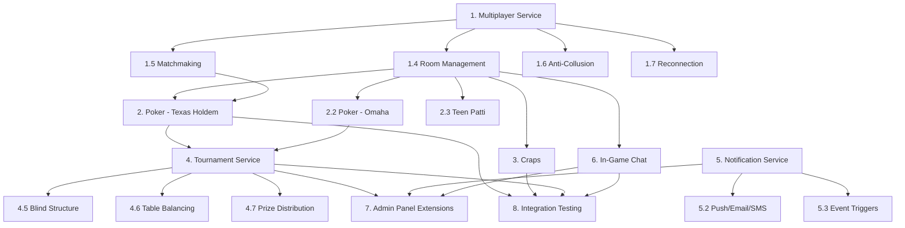

# Phase 3: Multiplayer & Social - Detailed Implementation Plan

## Overview

Phase 3 adds real-time multiplayer capabilities, player-vs-player games (Poker), full Craps implementation, the Tournament system, in-game chat, and the Notification Service. This phase transforms the platform from single-player games into a social, competitive gaming environment.

**Prerequisites**: Phase 2 complete (Game Engine, Card/Dice/Slot games, Betting, WebSocket Gateway, Admin Panel).

---

## 1. Multiplayer Service (Golang Kratos)

### 1.1 Project Setup
- Initialize Kratos project: `kratos new multiplayer-service`
- Configure gRPC (port 9009), HTTP (port 8009)
- Redis (room state, matchmaking queues), NATS (events)
- Create `Dockerfile`

### 1.2 Protobuf Definitions

- `proto/multiplayer/v1/multiplayer_service.proto`:
  - `CreateRoom` - Create a new game room/table
  - `JoinRoom` - Join an existing room
  - `LeaveRoom` - Leave a room
  - `SpectateRoom` - Join as spectator
  - `GetRoomState` - Get current room state
  - `ListRooms` - List available rooms with filters
  - `KickPlayer` - Admin: remove player from room
  - `CloseRoom` - Admin: close a room
  - `FindMatch` - Enter matchmaking queue
  - `CancelMatchmaking` - Leave matchmaking queue
- `proto/multiplayer/v1/multiplayer_messages.proto`

### 1.3 Database Migrations

- Migration 001: Create `rooms` table
  ```
  id (UUID PK), game_definition_id (FK), room_type (cash/tournament/private),
  name, status (waiting/active/paused/closed),
  min_players, max_players, current_players,
  min_buy_in, max_buy_in, small_blind, big_blind,
  rake_config (JSONB), table_config (JSONB),
  created_by, created_at, closed_at
  ```
- Migration 002: Create `room_players` table
  ```
  id (UUID PK), room_id (FK), player_id, seat_number,
  status (active/sitting_out/disconnected/eliminated),
  stack (DECIMAL - current chip count), buy_in_amount,
  joined_at, left_at
  ```
- Migration 003: Create `matchmaking_history` table
  ```
  id (UUID PK), player_id, game_type, stake_level,
  skill_rating, status (queued/matched/cancelled/expired),
  matched_room_id, queued_at, matched_at
  ```

### 1.4 Room Management

- **Room lifecycle**: Created → Waiting → Active → Paused → Closed
- **Room types**:
  - **Cash game rooms**: Players can join/leave anytime, buy-in with real money
  - **Tournament rooms**: Managed by Tournament Service, fixed player set
  - **Private rooms**: Invitation-only, custom settings
- **Seat management**:
  - Assign seats (sequential or player choice)
  - Reserve seats (30s hold for disconnected players)
  - Seat change requests
  - Wait list when table is full
- **Room state in Redis**:
  ```
  room:{room_id} → {status, players, game_state, config}
  room:{room_id}:seats → Hash of seat_number → player_id
  room:{room_id}:waitlist → List of waiting player_ids
  ```

### 1.5 Matchmaking Engine

- **Matchmaking criteria**:
  - Game type (Poker, Teen Patti, Liar's Dice)
  - Stake level (micro, low, medium, high, VIP)
  - Skill rating (ELO-based, optional)
- **Matchmaking algorithm**:
  1. Player enters queue with preferences
  2. Store in Redis sorted set: `matchmaking:queue:{game}:{stake}`
  3. Background worker scans queues every 2 seconds
  4. When enough players found (min_players), create room
  5. Notify matched players via WebSocket
  6. Players have 30s to accept, or re-queue
- **Queue timeout**: 120 seconds, then expand search criteria

### 1.6 Anti-Collusion System

- **Detection methods**:
  - Track players who frequently appear at same tables
  - Analyze hand histories for chip dumping patterns
  - Monitor win/loss patterns between specific player pairs
  - IP address and device fingerprint correlation
- **Scoring**: Collusion risk score per player pair
- **Actions**: Alert compliance team, auto-separate flagged players
- **Data stored in TimescaleDB** for pattern analysis

### 1.7 Reconnection Handling

- On disconnect:
  1. Mark player as "disconnected" in room
  2. Start 60-second grace timer
  3. If turn-based game: start action timeout (30s)
  4. Broadcast disconnect event to room
- On reconnect:
  1. Validate JWT and player identity
  2. Restore full room state from Redis
  3. Resume player position
  4. Cancel grace timer
  5. Broadcast reconnect event to room
- On grace period expiry:
  - Cash game: Sit player out, preserve stack
  - Tournament: Auto-fold each hand, blind away

---

## 2. Poker Implementation (Card Game Service Extension)

### 2.1 Texas Hold'em

#### 2.1.1 Game Configuration
```json
{
  "variant": "texas_holdem",
  "type": "no_limit",
  "min_players": 2,
  "max_players": 9,
  "small_blind": 1.00,
  "big_blind": 2.00,
  "min_buy_in": 40.00,
  "max_buy_in": 200.00,
  "ante": 0,
  "time_bank": 30,
  "auto_muck": true
}
```

#### 2.1.2 Hand Flow
1. **Pre-hand**: Post blinds (small blind, big blind), optional ante
2. **Pre-flop**: Deal 2 hole cards to each player, betting round (UTG starts)
3. **Flop**: Deal 3 community cards, betting round (first active player left of dealer)
4. **Turn**: Deal 1 community card, betting round
5. **River**: Deal 1 community card, final betting round
6. **Showdown**: Best 5-card hand from 7 cards wins

#### 2.1.3 Player Actions
| Action | Description | Conditions |
|--------|-------------|------------|
| Fold | Surrender hand | Any time during betting |
| Check | Pass action | No bet to call |
| Call | Match current bet | Bet exists to call |
| Bet | Place initial bet | No bet in current round |
| Raise | Increase current bet | Bet exists, raise allowed |
| All-in | Bet entire stack | Any time (creates side pot if needed) |

#### 2.1.4 Pot Management
- **Main pot**: All players eligible
- **Side pots**: Created when player goes all-in with less than others
- **Pot calculation**: Track contributions per player per betting round
- **Split pot**: When multiple players have equal best hand

#### 2.1.5 Hand Evaluator
- Implement poker hand ranking (highest to lowest):
  1. Royal Flush
  2. Straight Flush
  3. Four of a Kind
  4. Full House
  5. Flush
  6. Straight
  7. Three of a Kind
  8. Two Pair
  9. One Pair
  10. High Card
- Kicker comparison for tie-breaking
- Optimized evaluation using lookup tables

#### 2.1.6 Dealer Button & Blinds
- Dealer button rotates clockwise each hand
- Small blind: Player left of dealer
- Big blind: Player left of small blind
- Dead button rule: Handle when players leave mid-game
- Missed blind tracking

#### 2.1.7 Rake Calculation (Poker-specific)
- **Pot rake**: Percentage of pot (typically 2.5-5%)
- **Cap**: Maximum rake per hand (e.g., $3 cap)
- **No flop, no drop**: No rake if hand doesn't reach flop
- **Rake by pot size**: Tiered rake based on pot amount
- **Rake per player**: Distribute rake tracking per player for commission calculations

### 2.2 Omaha

#### 2.2.1 Differences from Texas Hold'em
- 4 hole cards dealt (instead of 2)
- Must use exactly 2 hole cards + 3 community cards
- Pot Limit betting (max raise = current pot size)
- Higher variance, bigger pots

#### 2.2.2 Game Configuration
```json
{
  "variant": "omaha",
  "type": "pot_limit",
  "min_players": 2,
  "max_players": 9,
  "small_blind": 1.00,
  "big_blind": 2.00,
  "min_buy_in": 80.00,
  "max_buy_in": 400.00
}
```

#### 2.2.3 Hand Evaluation
- Enumerate all C(4,2) * C(5,3) = 60 possible 5-card combinations
- Select best hand from all combinations
- Same hand rankings as Texas Hold'em

### 2.3 Teen Patti (Indian Poker)

#### 2.3.1 Game Configuration
```json
{
  "variant": "teen_patti",
  "min_players": 2,
  "max_players": 7,
  "boot_amount": 1.00,
  "max_blind_rounds": 4,
  "pot_limit": 1024,
  "sideshow_enabled": true
}
```

#### 2.3.2 Hand Rankings (highest to lowest)
1. Trail/Set (Three of a Kind)
2. Pure Sequence (Straight Flush)
3. Sequence (Straight)
4. Color (Flush)
5. Pair
6. High Card

#### 2.3.3 Game Flow
1. Each player posts boot amount
2. Deal 3 cards face down to each player
3. Players choose to play "blind" (without seeing cards) or "seen" (after seeing)
4. Betting rounds: Blind players bet 1x-2x current stake, Seen players bet 2x-4x
5. Sideshow: Seen player can request comparison with previous seen player
6. Continue until 2 players remain or someone calls for show
7. Best hand wins the pot

---

## 3. Craps Implementation (Dice Game Service Extension)

### 3.1 Game Configuration
```json
{
  "min_bet": 5.00,
  "max_bet": 5000.00,
  "max_odds_multiplier": 3,
  "field_pays_12": "3:1",
  "table_seats": 16
}
```

### 3.2 Bet Types

#### 3.2.1 Pass Line Bets
| Bet | When | Wins | Loses | Payout |
|-----|------|------|-------|--------|
| Pass Line | Come-out | 7 or 11 | 2, 3, or 12 | 1:1 |
| Pass Line (Point) | Point phase | Point before 7 | 7 before Point | 1:1 |
| Don't Pass | Come-out | 2 or 3 | 7 or 11 | 1:1 |
| Don't Pass (Point) | Point phase | 7 before Point | Point before 7 | 1:1 |

#### 3.2.2 Come/Don't Come Bets
- Same as Pass/Don't Pass but placed after come-out roll
- Each Come bet establishes its own point

#### 3.2.3 Odds Bets (True Odds)
| Point | True Odds | Payout |
|-------|-----------|--------|
| 4 or 10 | 2:1 | 2:1 |
| 5 or 9 | 3:2 | 3:2 |
| 6 or 8 | 6:5 | 6:5 |

#### 3.2.4 Place Bets
| Number | Payout |
|--------|--------|
| 4 or 10 | 9:5 |
| 5 or 9 | 7:5 |
| 6 or 8 | 7:6 |

#### 3.2.5 Proposition Bets (Single Roll)
| Bet | Payout |
|-----|--------|
| Any 7 | 4:1 |
| Any Craps (2,3,12) | 7:1 |
| Yo (11) | 15:1 |
| Aces (2) | 30:1 |
| Boxcars (12) | 30:1 |
| Horn | Combination bet |
| Field (3,4,9,10,11) | 1:1, (2 pays 2:1, 12 pays 3:1) |
| Hardways (4,6,8,10) | 7:1 to 9:1 |

### 3.3 Game Flow

1. **Come-out Roll Phase**:
   - Shooter (rotating player) rolls 2 dice
   - If 7 or 11: Pass Line wins, Don't Pass loses
   - If 2, 3, or 12: Pass Line loses (craps)
   - If 4, 5, 6, 8, 9, or 10: Establish Point
2. **Point Phase**:
   - Shooter continues rolling
   - If Point number: Pass Line wins
   - If 7: Pass Line loses (seven-out), new shooter
   - Other numbers: Resolve applicable bets (Come, Place, Props)
3. **Multi-player**: All players bet simultaneously, one shooter at a time

### 3.4 Craps State Machine
```
States: WaitingForShooter → ComeOutRoll → PointEstablished → 
        Rolling → SevenOut → NewShooter
```

---

## 4. Tournament Service (Java Spring Boot)

### 4.1 Project Setup
- Initialize Spring Boot project with:
  - Spring Web, Spring Data JPA, Spring Security
  - gRPC server (port 9010)
  - PostgreSQL (casino_tournaments DB)
  - Redis, NATS
- Create `Dockerfile`

### 4.2 Protobuf Definitions

- `proto/tournament/v1/tournament_service.proto`:
  - `CreateTournament` - Admin: create tournament
  - `ListTournaments` - List available tournaments
  - `GetTournamentDetails` - Tournament info and status
  - `RegisterForTournament` - Player registration
  - `UnregisterFromTournament` - Cancel registration
  - `GetTournamentLeaderboard` - Current standings
  - `GetTournamentHistory` - Past tournaments
  - `StartTournament` - Admin/Auto: begin tournament
  - `PauseTournament` / `ResumeTournament`
  - `CancelTournament`
  - `RebuyRequest` / `AddonRequest`

### 4.3 Database Migrations (casino_tournaments)

- Migration 001: Create `tournaments` table
  ```
  id (UUID PK), name, description, game_definition_id (FK),
  type (scheduled/sit_and_go/freeroll/satellite),
  format (freezeout/rebuy/addon/bounty/knockout),
  status (upcoming/registering/running/paused/completed/cancelled),
  buy_in, entry_fee, starting_chips, min_players, max_players,
  current_players, registered_players,
  prize_pool_type (guaranteed/contributed),
  guaranteed_prize_pool, actual_prize_pool,
  late_registration_levels, rebuy_levels, rebuy_cost, rebuy_chips,
  addon_available_at_level, addon_cost, addon_chips,
  starts_at, registration_opens_at, registration_closes_at,
  ended_at, created_by, created_at, updated_at
  ```
- Migration 002: Create `tournament_entries` table
  ```
  id (UUID PK), tournament_id (FK), player_id,
  status (registered/active/eliminated/finished),
  current_chips, rebuys_used, addon_used,
  finish_position, prize_won, bounties_collected,
  registered_at, eliminated_at
  ```
- Migration 003: Create `blind_structures` table
  ```
  id (UUID PK), tournament_id (FK), level, small_blind, big_blind,
  ante, duration_minutes
  ```
- Migration 004: Create `prize_structures` table
  ```
  id (UUID PK), tournament_id (FK), position_from, position_to,
  prize_type (percentage/fixed), prize_value, prize_description
  ```
- Migration 005: Create `tournament_tables` table
  ```
  id (UUID PK), tournament_id (FK), room_id (FK),
  table_number, status (active/breaking/closed),
  player_count, created_at
  ```

### 4.4 Tournament Types

#### 4.4.1 Scheduled Tournament
- Fixed start time, registration window
- Starts when minimum players met at scheduled time
- Late registration allowed for configurable number of blind levels
- If minimum not met: cancel and refund

#### 4.4.2 Sit-and-Go (SNG)
- Starts when max_players registered
- No scheduled time
- Typically 6, 9, or 10 players
- Fast blind structure

#### 4.4.3 Freeroll
- No buy-in required
- Prize pool funded by platform
- Used for promotions and player acquisition

#### 4.4.4 Satellite
- Winner(s) receive entry ticket to larger tournament
- Prize is tournament entry, not cash

#### 4.4.5 Bounty/Knockout
- Each player has a bounty on their head
- Eliminating a player awards their bounty
- Progressive bounty: bounty increases as you eliminate more players

### 4.5 Blind Structure Management

- Auto-escalating blind levels:
  ```
  Level 1: 25/50 (15 min)
  Level 2: 50/100 (15 min)
  Level 3: 75/150 (15 min)
  Level 4: 100/200 (15 min)
  Level 5: 150/300 (12 min)
  ...
  ```
- Ante introduction at configurable level
- Break scheduling (5 min break every 60 min)
- Blind timer broadcast via WebSocket

### 4.6 Table Balancing

- **Algorithm**: Keep all tables within 1 player of each other
- **Breaking tables**: When a table can be distributed to others
- **Moving players**: Select player closest to big blind position
- **Final table**: Combine remaining players when count allows
- **Broadcast**: Notify moved players via WebSocket with new table assignment

### 4.7 Prize Distribution

- **Percentage-based**: Top X% of players paid
  ```
  1st: 25%, 2nd: 15%, 3rd: 10%, 4th-6th: 5%, 7th-10th: 2.5%
  ```
- **Guaranteed prize pool**: Platform covers shortfall if entries < expected
- **Overlay**: Difference between guaranteed and actual prize pool
- **Auto-distribution**: Credit prizes to winner wallets at tournament end
- **Satellite prizes**: Award tournament tickets instead of cash

### 4.8 Leaderboard (Real-time)

- Redis sorted set: `tournament:{id}:leaderboard`
- Score = chip count (updated after each hand)
- Broadcast leaderboard updates every 30 seconds via WebSocket
- Final standings persisted to database

---

## 5. Notification Service (NestJS)

### 5.1 Project Setup
- Initialize NestJS project
- Install dependencies: Bull (job queue), nodemailer, firebase-admin, twilio
- Configure gRPC server (port 9011)
- PostgreSQL, Redis, NATS
- Create `Dockerfile`

### 5.2 Notification Channels

#### 5.2.1 Push Notifications
- **Android**: Firebase Cloud Messaging (FCM)
- **iOS**: Apple Push Notification Service (APNs) via FCM
- **Implementation**:
  - Store device tokens per user in database
  - Support multiple devices per user
  - Token refresh handling
  - Silent push for data updates

#### 5.2.2 Email
- **Provider**: AWS SES
- **Templates**: HTML email templates with Handlebars
- **Types**: Transactional (verification, password reset), Marketing (promotions)
- **Unsubscribe**: One-click unsubscribe link

#### 5.2.3 SMS
- **Provider**: Twilio
- **Types**: OTP verification, critical alerts
- **Rate limiting**: Max 5 SMS per user per hour

#### 5.2.4 In-App Notifications
- Stored in database, delivered via WebSocket
- Read/unread status tracking
- Notification center in mobile apps and admin panel

### 5.3 Event-Driven Triggers

| Event | Channel | Template |
|-------|---------|----------|
| `player.events.registered` | Email + Push | Welcome email |
| `player.events.kyc.approved` | Email + Push + In-App | KYC approved |
| `financial.events.deposit.completed` | Push + In-App | Deposit confirmed |
| `financial.events.withdrawal.approved` | Email + Push | Withdrawal processed |
| `game.events.bet.settled` (big win) | Push + In-App | Big win congratulations |
| `jackpot.events.won` | Email + Push + In-App + SMS | Jackpot winner |
| `tournament.events.starting` | Push + In-App | Tournament starting soon |
| `tournament.events.eliminated` | Push + In-App | Tournament elimination |
| `compliance.events.alert.triggered` | Email (admin) | AML alert |

### 5.4 Template Management

- Templates stored in database with versioning
- Variables: `{{player_name}}`, `{{amount}}`, `{{game_name}}`, etc.
- Localization: Templates per language (en, th, zh, etc.)
- Admin UI for template editing (WYSIWYG for email)

### 5.5 Notification Preferences

- Per-user preferences stored in database:
  ```json
  {
    "push_enabled": true,
    "email_marketing": false,
    "email_transactional": true,
    "sms_enabled": true,
    "in_app_enabled": true,
    "quiet_hours": {"start": "23:00", "end": "08:00"}
  }
  ```
- Respect quiet hours (queue and deliver after)
- Frequency capping: Max N notifications per channel per day

### 5.6 Job Queue (Bull/Redis)

- Separate queues per channel: `notifications:push`, `notifications:email`, `notifications:sms`
- Retry logic: 3 retries with exponential backoff
- Dead letter queue for failed notifications
- Priority levels: Critical (OTP, security) > High (financial) > Normal > Low (marketing)

---

## 6. In-Game Chat Service (NestJS Extension)

### 6.1 Chat Types
- **Table chat**: Messages visible to all players at a table
- **Tournament chat**: Messages visible to all tournament participants
- **Private messages**: Player-to-player (optional, can be disabled)
- **Support chat**: Player-to-support agent

### 6.2 Chat Features
- Real-time delivery via WebSocket
- Message types: text, emoji, predefined quick messages
- **Profanity filter**: Configurable word list + ML-based detection
- **Rate limiting**: Max 1 message per 2 seconds per user
- **Mute**: Players can mute other players
- **Admin moderation**: Admins can mute/ban players from chat
- **Chat history**: Last 100 messages stored per room in Redis, archived to DB

### 6.3 Quick Messages (Predefined)
```
"Nice hand!", "Good luck!", "Well played!", "Thank you!",
"Hurry up!", "LOL", "GG", "NH"
```

---

## 7. Admin Panel Extensions

### 7.1 Multiplayer Management
- Room list with real-time status
- Room detail view (players, game state, chat log)
- Force close room
- Kick player from room

### 7.2 Tournament Management Module
- Create tournament form (all configuration options)
- Tournament list with status filters
- Tournament detail view:
  - Registration list
  - Real-time leaderboard
  - Table assignments
  - Blind level progress
  - Prize distribution preview
- Tournament actions: Start, Pause, Resume, Cancel
- Tournament templates (save and reuse configurations)

### 7.3 Notification Management
- Template editor (WYSIWYG for email, text for push/SMS)
- Send targeted notifications (by segment, VIP level, etc.)
- Notification history and delivery stats
- Failed notification monitoring

---

## 8. Integration Testing

### 8.1 Multiplayer Tests
- Test room creation, join, leave, spectate
- Test matchmaking with multiple concurrent players
- Test reconnection within grace period
- Test reconnection after grace period expiry

### 8.2 Poker Tests
- Test complete Texas Hold'em hand:
  - Blinds posting, dealing, betting rounds, showdown
  - Side pot creation with all-in
  - Split pot with equal hands
- Test Omaha hand evaluation (must use exactly 2 hole cards)
- Test rake calculation (no flop no drop)

### 8.3 Craps Tests
- Test come-out roll outcomes (7/11 win, 2/3/12 craps)
- Test point establishment and resolution
- Test all proposition bet payouts
- Test multi-player simultaneous betting

### 8.4 Tournament Tests
- Test full SNG lifecycle (register → play → eliminate → prize)
- Test table balancing when player eliminated
- Test blind level escalation
- Test rebuy and addon
- Test late registration

### 8.5 Load Testing
- 50 concurrent poker tables (9 players each = 450 players)
- 10 concurrent tournaments (100 players each = 1000 players)
- Measure WebSocket message latency (target: < 50ms)
- Measure matchmaking time (target: < 10s)

---

## Phase 3 Task Dependency Graph



---

## Phase 3 Completion Criteria

- [ ] Multiplayer rooms functional with join/leave/spectate
- [ ] Matchmaking engine matching players within 10 seconds
- [ ] Texas Hold'em fully playable (2-9 players, all actions, side pots, rake)
- [ ] Omaha fully playable (pot-limit, 4 hole cards)
- [ ] Teen Patti fully playable (blind/seen play, sideshow)
- [ ] Craps fully playable (all bet types, come-out/point phases, multi-player)
- [ ] Anti-collusion detection flagging suspicious player pairs
- [ ] Reconnection handling within 60-second grace period
- [ ] Tournament Service supporting Scheduled, SNG, Freeroll, Satellite, Bounty
- [ ] Table balancing working correctly during tournaments
- [ ] Blind structure auto-escalation with timer broadcast
- [ ] Prize distribution auto-crediting winner wallets
- [ ] Notification Service delivering push, email, SMS, in-app
- [ ] In-game chat with profanity filter and moderation
- [ ] Admin panel: tournament management, room monitoring, notification management
- [ ] Load test: 450+ concurrent poker players, < 50ms WebSocket latency
